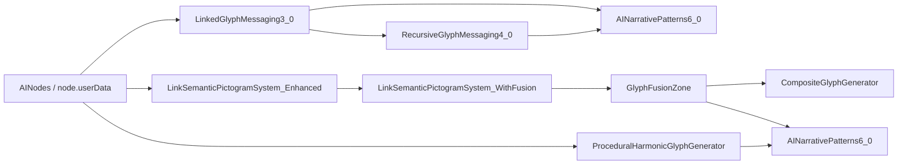

# MAPA GLYPH SYSTÉMOV

## Účel

Tento dokument mapuje kedy sa ktorý glyph systém realne spawnuje v runtime, aké sú triggery a ako spolu súvisia.

---

## CHRONOLOGICKÁ MAPA SPAWN TRIGGEROV

| Systém | Kedy sa spawnne | Realny trigger | Poznámka |
|--------|----------------|----------------|----------|
| `_GlyphLayer4_MultiFusion` | pri inicializácii worldu a potom pri nových nodoch | `main.js` zavolá `createGlyphFusionsForNodes(aiNodes.nodes)` a registruje `postSpawnObserver` pre `createGlyphFusion` | 1x na node; hlavná node-glyph cesta |
| `_LinkGlyphFlow.js` | pri aktivnom linku v každom visual ticku | `LinkGlyphFlow.update()` buduje packet cez `createGlyphPacket()` / `refreshPacketsForLinks()` | spawn je priebežný a závisí od sily linku |
| `_LinkedGlyphMessaging3_0.js` | ked sa generuje link message | `update()` spawnuje `spawnMessage()` pod limitom `maxMessagesPerLink` | message glyph je transportná vrstva |
| `_RecursiveGlyphSignalSystem.js` | pri selection / hover / link create / link remove | `triggerAttentionSignal()` alebo `triggerResidueSignal()` → `_spawnSignal()` | burst signal glyph, nie permanentný objekt |
| `GlyphFusionZone.js` + `CompositeGlyphGenerator.js` | ked sa pri node zidú 2+ glyphy a zona vstupí do fusion fazy | convergence detection v link/fusion update ceste, potom `createCompositeGlyph()` | composite vznikne až po realnej konvergencii |
| `_CompositeGlyphResonanceFeedback.js` | hned po registracii composite glyphu | `registerCompositeGlyph()` pridá resonance halo okolo fusion glyphu | doplnkový visual after-effect |
| `ProceduralHarmonicGlyphGenerator.js` | len pre stabilné huby v periodickom checku | hub age približne 45s, learning strength nad threshold, reinforcement nad threshold | veľmi zriedkavý learned glyph |
| `_AtomaGlyphSystem3_0.js` / `_AtomaGlyphSystem4_0.js` | len manuálne alebo debug helperom | `createGlyph()`, `createGlyph4()`, `assignGlyphToNode()` a pribuzné helpery | nie je canonical live spawn path |

---

## DISCOVERIES

### Hierarchy of Glyph Systems

**Layer 1: LinkedGlyphMessaging3_0**
- Basic message packets traveling along links
- Foundation for glyph messaging

**Layer 2: RecursiveGlyphMessaging4_0**
- Hierarchical recursive chains extending from 3.0
- Builds complex meaning chains from simple messages

**Layer 3: EmergentThoughtStorms5_0**
- Collision phenomena
- Emergent visual storms from network activity

**Layer 4: SemanticGlyphAI**
- Node semantic expression
- Scanlines and semantic overlays

**Layer 5: AdaptiveGlyphRendering + LinkedGlyphSync**
- Visual coherence layer
- Synchronizes glyph rendering across systems

**Layer 6: AINarrativePatterns6_0**
- Narrative structure layer
- Consumes events from multiple glyph systems

### Visibility Issues

**ProceduralHarmonicGlyphGenerator** - prečo bol málo viditeľný:
- Very conservative spawn conditions (45s hub age, 0.4 learning strength)
- Subtle visuals (45% opacity, grey color)

**CompositeGlyphGenerator** - nie je samostatný:
- Helper pre GlyphFusionZone, nie standalone system

**GlyphFusionZone** - závislosť na konvergencii:
- Vyžaduje 2+ glyphy konvergujúce pri node
- Convergence data dostáva z `LinkSemanticPictogramSystem_WithFusion`

---

## IMPLEMENTATION ACCOMPLISHED

### 1. Pripojenie _LinkedGlyphMessaging3_0 ↔ _RecursiveGlyphMessaging4_0

**Zmeny v _LinkedGlyphMessaging3_0.js:**
- Added `setRecursiveGlyphMessaging()` - umožňuje nastaviť referenciu na 4.0
- Pridaná podpora pre `narrativePatterns` referenciu

**Zmeny v _RecursiveGlyphMessaging4_0.js:**
- Added `setLinkedGlyphMessaging()` - umožňuje nastaviť referenciu na 3.0
- Added `onMessageSpawned()` callback - volá sa keď 3.0 spawnne message
- Added `generateChainFromMessage()` - vytvára reťazce z message dát
- Wired v main.js

### 2. Integrácia AINarrativePatterns6_0 s glyph systémami

**Zmeny v _AINarrativePatterns6_0.js:**
- Added event handlers:
  - `onMessageSpawned()` - keď sa spawnú message glyphy
  - `onGlyphFusion()` - keď fusion zone triggeruje
  - `onProceduralGlyphSpawned()` - keď sa spawnú procedural glyphy
- Added helpers:
  - `findClusterForNode()` - nájde cluster pre node
  - `findClusterForPosition()` - nájde cluster pre pozíciu
  - `_queueMotifShift()` - prechod medzi motívmi
- Updated `initializeNarrative()` - ukladá nodeIds a centerPos
- Added processing of pending motif shifts v `updateNarrativePhase()`

**Pripojenie event zdrojov:**

_LinkedGlyphMessaging3_0.js:**
- Pridaná `narrativePatterns` referencia
- Volá `onMessageSpawned()` pri spawne message

GlyphFusionZone.js:**
- Pridaná `narrativePatterns` do `GlyphFusionZoneManager`
- Volá `onGlyphFusion()` po `initiateFusion()`

ProceduralHarmonicGlyphGenerator.js:**
- Pridaná `narrativePatterns` referencia
- Volá `onProceduralGlyphSpawned()` po inicializácii glyphu

**Wiring v main.js:**
- Updated `setupNarrativePatterns()` - pripojenie všetkých systémov
- Updated `setupLinkedGlyphMessaging()` - wiring s 4.0 a narrative
- Updated `setupRecursiveGlyphMessaging()` - wiring s 3.0

### 3. Zvýšenie visibility ProceduralHarmonicGlyphGenerator

**Config zmeny:**
- `GLYPH_OPACITY`: 0.45 → **0.65** (+44% visibility)
- `GLYPH_COLOR`: 0xd8d8d8 → **0x66ddff** (cyan namiesto grey)
- `GLYPH_SCALE`: 1.2 → **1.4** (+17% size)
- `MIN_HUB_AGE_SECONDS`: 45 → **30** (rýchlejšie spawnovanie)
- `MIN_LEARNING_STRENGTH`: 0.4 → **0.3** (nižší threshold)
- `MIN_REINFORCEMENT_LEVEL`: 0.5 → **0.4** (nižší threshold)
- `GLYPH_EMERGE_DURATION`: 3.0 → **2.0** (rýchlejšia animácia)

---

## RELEVANT FILES

### Core Glyph Systems
- `_LinkedGlyphMessaging3_0.js` - Basic glyph messaging, integrácia s RecursiveMessaging4.0 a NarrativePatterns6.0
- `_RecursiveGlyphMessaging4_0.js` - Recursive chains, `setLinkedGlyphMessaging()`, `onMessageSpawned()`, `generateChainFromMessage()`
- `_AINarrativePatterns6_0.js` - Narrative layer, event handlers pre message/fusion/procedural events
- `GlyphFusionZone.js` - Fusion zone manager, `setNarrativePatterns()` a callback
- `ProceduralHarmonicGlyphGenerator.js` - Procedural glyphs, `setNarrativePatterns()` a increased visibility config

### Supporting Systems
- `LinkSemanticPictogramSystem_Enhanced.js` - Creates glyphs that travel along links
- `LinkSemanticPictogramSystem_WithFusion.js` - Wraps Enhanced + FusionZone
- `CompositeGlyphGenerator.js` - Helper for GlyphFusionZone, nie standalone
- `LinkRendererConduit.js` - Creates LinkSemanticPictogramSystem_WithFusion
- `main.js` - Wiring všetkých integrácií

### Documentation
- `GLYPH_VISUAL_MAP.md` - Compact orientation map pre hlavné glyph systémy
- `ATOMA GLYPH SYSTEM ARCHITECTURE MAP AUDIT.md` - Kompletný audit 15 glyph systémov

---

## POZNÁMKY

- `AINarrativePatterns6_0` je v tejto mape len consumer eventov, nie primary spawn zdroj
- Mythic glyph system bol úmyselne vynechaný z tejto mapy
- CompositeGlyphGenerator nie je samostatný system, ale helper pre GlyphFusionZone
- GlyphFusionZone dostáva convergence data z `LinkSemanticPictogramSystem_WithFusion`, nie priamo

---

## MAPA INTEGRÁCIÍ

---

**Last Updated:** 2026-04-10
**Author:** Bystrik Matajzik
**Phase:** EVOLUTION_V2
