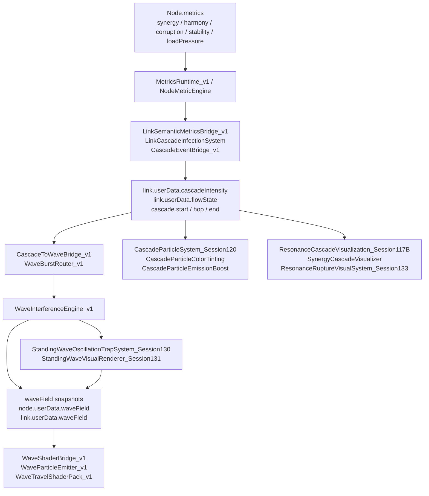

Áno. Tu je presnejší pohľad na problém:

- **canonical metriky sú v zásade v poriadku**
- problém je, že ich vizuálne systémy často preklápajú do **ďalších odvodených názvov**, ktoré sa správajú ako pseudo-metriky
- výsledok je, že máš:
  - viac názvov pre ten istý význam,
  - viac writerov pre jednu vec,
  - a ťažko sa potom hľadá, čo je „pravda“ a čo je iba vizualizačný prepočet

Najväčší chaos nie je v `synergy/harmony/corruption/stability/loadPressure`, ale v tom, že okolo nich vznikli tieto vrstvy:
- `cascade.*` eventy
- `flowState.*`
- `waveField.*`
- `trap.*`
- a potom ešte od nich odvodené presentation metriky ako `synergyCoherence`, `stabilityFactor`, `harmonyDominance` atď.

Nižšie je praktický prehľad.

**1. Mentálny model**
- `metrics.*` = canonical vstupné metriky
- `cascade.*` = semantic lifecycle udalosti
- `flowState.*` = link-side prechodový stav
- `waveField.*` = wave snapshot pre vizuály
- `trap.*` = standing-wave interný stav
- `*Boost`, `*Factor`, `*Index`, `*Dominance`, `*Modulation` = väčšinou len vizualizačné odvodeniny

---

**2. Prehľad submetrík**
| Field | Čo znamená | Typ | Kto ho typicky zapisuje | Kto ho typicky číta | Poznámka |
|---|---|---|---|---|---|
| `node.userData.metrics.synergy` | koherencia prepojenia / harmonická kompatibilita | canonical | `NodeMetricEngine`, `MetricsRuntime_v1` | glyph, resonance, wave routing systémy | OK |
| `node.userData.metrics.harmony` | harmonická kompatibilita / alignment | canonical | `NodeMetricEngine`, `MetricsRuntime_v1` | glyph, resonance, wave systémy | OK |
| `node.userData.metrics.corruption` | kontaminácia / destabilizácia | canonical | `NodeMetricEngine`, `MetricsRuntime_v1`, `LinkCorruptionTransmission_v1` | corruption visuals, wave burst routing | OK |
| `node.userData.metrics.stability` | stabilita / odolnosť voči stresu | canonical | `NodeMetricEngine`, `MetricsRuntime_v1` | wave, glyph, stress vizuály | OK |
| `node.userData.metrics.loadPressure` | network stress / zaťaženie | canonical | `NodeMetricEngine`, `MetricsRuntime_v1` | burst routing, shaders, HUD | OK |
| `link.userData.cascadeIntensity` | sila cascade propagácie | semantic link field | `LinkSemanticMetricsBridge_v1`, `LinkCascadeInfectionSystem`, `CascadeEventBridge_v1` | cascade particles, tinting, rupture, density adapter | viac writerov |
| `link.userData.flowState.intensity` | lokálny link flow/cascade stav | transitional state | `CascadeEventBridge_v1`, seed/init cesty | particle density, wave routing | viac writerov |
| `link.userData.flowState.energy` | harmonic energy na linku | transitional state | aktuálne už len read-only snapshot po cleanup, historicky viac writerov | link resonance / wave consumers | mal by byť skôr snapshot než canonical writer |
| `node.userData.waveField` | wave snapshot pre node | presentation snapshot | `StandingWaveOscillationTrapSystem_Session130`, `CascadingHarmonicResonanceAmplification`, fallback `LinkCascadeInfectionSystem` | `WaveParticleEmitter_v1`, `WaveShaderBridge_v1`, `WaveTravelShaderPack_v1` | viac writerov |
| `link.userData.waveField` | wave snapshot pre link | presentation snapshot | `LinkCascadeInfectionSystem` fallback, prípadne `CascadeToWaveBridge` fallback path | `WaveParticleEmitter_v1`, `WaveShaderBridge_v1` | OK ako fallback |
| `trap.amplitude` | amplitúda standing-wave trapu | internal state | `StandingWaveOscillationTrapSystem_Session130` | `StandingWaveVisualRenderer_Session131`, `ResonanceRuptureVisualSystem_Session133` | interné, ale živé |
| `trap.phase` | fáza standing-wave trapu | internal state | `StandingWaveOscillationTrapSystem_Session130` | `StandingWaveVisualRenderer_Session131` | interné, ale živé |
| `cascade.start` | vstup do cascade lifecycle | event | `LinkSemanticMetricsBridge_v1`, `CascadeEventBridge_v1`, niektoré visual bridge systémy | cascade vizualizéry, wave router, rupture | nie je field, je to event |
| `cascade.hop` | propagácia cascade na ďalší hop | event | `LinkSemanticMetricsBridge_v1`, `LinkCascadeInfectionSystem`, `CascadeEventBridge_v1`, `CascadeParticleSystem`, `SynergyCascadeVisualizer` | wave bridge, particles, visualizéry | nie je field, je to event |
| `cascade.end` | ukončenie cascade životného cyklu | event | `LinkSemanticMetricsBridge_v1`, `CascadeEventBridge_v1`, visual systémy | vizualizéry, cleanup logika | nie je field, je to event |

---

**3. Odvodené submetriky, ktoré ťa najviac mätú**
Tieto nie sú canonical metrics. Sú to lokálne výpočty, často s rovnakým názvom v rôznych systémoch.

| Submetrika | Čo zvyčajne znamená | Typický výpočet | Riziko duplicity |
|---|---|---|---|
| `synergyCoherence` | ako koherentná je synergia vzhľadom na harmony/corruption | napr. v `CompositeGlyphResonanceFeedback`: `harmony * (1 - corruption * 0.5)` | vysoké, názov sa používa ako „lepivá“ metrika |
| `harmonyDominance` | dominancia harmony nad ostatnými zložkami | často len `metrics.harmony` alebo vážený podiel | vysoké, často len premenované harmony |
| `synergyBoost` | multiplikátor vizuálnej/systémovej intenzity | `1 + synergy * konstanta` | vysoké, používa sa v glyph aj resonance systémoch |
| `stabilityFactor` | dampening / stabilizačný faktor | v niektorých systémoch `1 - stability`, inde `1 - corruption * layerWeight` | veľmi vysoké, názov je prepísaný v rôznych významoch |
| `stabilityIndex` | vzdialenosť od stabilného stavu | napr. `abs(harmony - (1 - corruption))` | vysoké, čisto derived/presentation |
| `CorruptionModulation` | modifikátor korupcie pre vizuál/flow | často pomocný koeficient v audio/visual systémoch | stredné až vysoké |
| `corruptionRise` | nárast corruption spike | väčšinou event alebo delta | vysoké, často event aj metrika naraz |

Z toho najproblematickejšie sú:
- `stabilityFactor`
- `synergyBoost`
- `harmonyDominance`

Lebo to nie sú jednotné kanonické pojmy. Sú to skôr **lokálne odvodzovacie názvy**, ktoré v rôznych súboroch znamenajú niečo mierne iné.

---

**4. Dátový tok**
Toto je jednoduchšia a praktickejšia mapa toho, čo sa deje v runtime:

Ak to povieš úplne jednoducho:
- **node metrics** vyrobia stav
- **cascade bridges** preložia stav na eventy
- **wave engine** preloží eventy na wave snapshot
- **particle / resonance / shader systémy** čítajú snapshoty a kreslia

---

**5. Kde je duplicita a prečo je to ťažko udržateľné**
Najväčšie duplicity dnes:

1. **`cascadeIntensity`**
- je zapisované viacerými cestami
- je čítané ako stavebný input pre particles, tinting, rupture a density
- problém nie je existencia derivácie, ale že máš viac writerov a viac fallbackov

2. **`flowState`**
- používa sa ako prechodový link stav
- ale zároveň sa doň tlačí energia, typ, direction, intensity
- to je typický kandidát na „príliš veľa významov v jednom objekte“

3. **`waveField`**
- je to mix:
  - canonical solver snapshot
  - fallback data
  - vizualizačný input
- okolo jedného názvu je viac interpretácií

4. **`stabilityFactor` / `synergyBoost` / `harmonyDominance`**
- lokálne vizuálne prepočty
- ale názvy vyzerajú ako kanonické metriky
- to je hlavný dôvod, prečo sa v tom ľahko stratíš

---

**6. Lean odporúčanie: ako to zoštíhliť**
Tu je moje pragmatické odporúčanie, nie „čistenie pre čistotu“.

**A. Rozdeľ dáta do 3 vrstiev**
- `metrics.*` = iba canonical state
- `semantic.*` alebo `cascade.*` = iba eventy a lifecycle
- `field.*` alebo `waveField.*` = iba renderer-ready snapshoty

To znamená:
- canonical metrics sa nemajú nazývať `stabilityFactor` ani `synergyBoost`
- to sú presentation variables, nie source-of-truth

**B. Jeden writer na jednu semantiku**
- `cascadeIntensity` nech píše len jeden runtime authority
- `waveField` nech generuje len solver/bridge vrstva
- visual systémy nech iba čítajú

**C. Zruš „viac názvov pre tú istú vec“**
Napríklad:
- `stabilityFactor` nech je len jeden lokálny názov v jednom súbore
- ak má rovnaký význam v inom súbore, premenovať na explicitnejší názov:
  - `glyphStabilityFactor`
  - `waveDampingFactor`
  - `resonanceStabilityFactor`

**D. Eventy nech sú len eventy**
- `cascade.start / hop / end` sú výborné
- ale nesmú sa miešať s data fields
- event je signal, field je state

**E. Jedna canonical glossary tabuľka**
To je podľa mňa najlepší ďalší krok:
- `docs/audits/VFX_METRICS_DICTIONARY.md`
- stĺpce:
  - `field`
  - `meaning`
  - `canonical writer`
  - `derived formula`
  - `readers`
  - `allowed aliases`
  - `notes`

Taký dokument ti zníži mentálny chaos viac než ďalších 10 patchov.

---

**7. Čo by som zoštíhľoval ako prvé**
Priorita podľa úžitku:

1. `cascade.*` event pipeline
- vybrať jeden canonical source pre lifecycle
- ostatné len alias alebo fallback

2. `waveField`
- jeden solver writer pre node waveField
- jeden fallback writer pre link waveField
- nič viac

3. `flowState`
- oddeliť `energy`, `intensity`, `type`, `direction`
- ak niečo nie je canonical, nech je to read-only snapshot

4. pomenovanie derived modifierov
- `stabilityFactor`, `synergyBoost`, `harmonyDominance`
- premenovať podľa domény, aby nevyzerali ako canonical metrics

---

Ak chceš, ďalší krok viem spraviť veľmi prakticky:
1. pripraviť ti **čistú markdown tabuľku** pre `docs/audits/VFX_METRICS_DICTIONARY.md`,
2. alebo spraviť **detailný field-by-field audit** len pre `cascade/wave/resonance` so stĺpcami:
   - `FIELD`
   - `WRITERS`
   - `READERS`
   - `FORMULA`
   - `STATUS`
   - `RECOMMENDED OWNER`

Ak chceš, spravím hneď tú tabuľku.