# ATOMA VFX Dependency Map

Vizuálna mapa závislostí VFX systémov v ATOMA. Šípy ukazujú smer závislosti (A → B znamená "A závisí na B").

---

## Legend

```
🔵 Core Authorities - Základné systémy, ktoré ostatné využívajú
🟢 Bridge Systems - Mosty medzi systémami
🟡 Particle Systems - Systémy častíc
🟠 Wave Systems - Vlnové systémy
🔴 Cascade Systems - Kaskádové systémy
🟣 Synergy/Harmony Systems - Systémy pre sýnergiu a harmóniu
🟤 Visual Controllers - Ovládacie vizuálne systémy
⚫ Debug/Audit Systems - Debugovacie a auditné systémy
```

---

## Core Dependencies Graph

```mermaid
graph TD
    %% CORE AUTHORITIES
    Core[FrameScheduler<br/>🔵 Time Authority]
    Metrics[MetricsRuntime<br/>🔵 Metrics Authority]
    VHR[VisualHierarchyRegistry<br/>🔵 Visual Authority]
    SMA[SemanticMetricAdapter<br/>🔵 Semantic Authority]
    VT[VisualTime<br/>🔵 Time Service]
    VA[VisualAuthority<br/>🔵 Visual Authority]
    VTR[VisualTemplateRegistry<br/>🔵 Template Authority]
    VAW[VisualAutoWiringSystem<br/>🟤 Auto-Wiring]

    %% CORE RENDERING
    LinkRC[LinkRendererConduit<br/>🔵 Core Link Renderer]
    NodeV[_NodeVisuals4_0<br/>🔵 Core Node Visuals]
    NodeLink[NodeLinkingSystem<br/>🔵 Link Authority]

    %% BRIDGE SYSTEMS
    LinkMB[LinkMetricsToVisualBridge_v1<br/>🟢 Metrics Bridge]
    LinkSB[LinkSemanticMetricsBridge_v1<br/>🟢 Semantic Bridge]
    SynergyCB[SynergyCascadeFXBridge_v1<br/>🟢 Synergy-Cascade Bridge]
    CascadeEB[CascadeEventBridge_v1<br/>🟢 Cascade Event Bridge]
    CascadeWB[CascadeToWaveBridge_v1<br/>🟢 Cascade-Wave Bridge]
    WaveSB[WaveShaderBridge_v1<br/>🟢 Wave-Shader Bridge]
    PulseWB[PulseWaveSystemBridge_v1<br/>🟢 Pulse-Wave Bridge]

    %% PARTICLE SYSTEMS
    CascadePS[CascadeParticleSystem_Session120<br/>🟡 Cascade Particles]
    HealingPS[HealingParticleSystem_Session136<br/>🟡 Healing Particles]
    WavePE[WaveParticleEmitter_v1<br/>🟡 Wave Particles]
    LinkCPS[LinkCorruptionParticleSystem<br/>🟡 Corruption Particles]
    LinkHPS[LinkHealingParticleSystem<br/>🟡 Healing Link Particles]
    LinkSS[LinkSparkSystem<br/>🟡 Spark Particles]
    LinkTPS[LinkTrailParticleSystem<br/>🟡 Trail Particles]
    ParticleTrail[ParticleTrailSystem_Session122<br/>🟡 Particle Trails]

    %% WAVE SYSTEMS
    WaveIE[WaveInterferenceEngine_v1<br/>🟠 Interference Engine]
    StandingVR[StandingWaveVisualRenderer_Session131<br/>🟠 Standing Waves]
    WaveBR[WaveBurstRouter_v1<br/>🟠 Wave Burst Router]
    OscillationTrap[OscillationTrapVisualSystem_Session132<br/>🟠 Oscillation Traps]
    WaveIPS[WaveInterferencePatternSystem_Session132<br/>🟠 Interference Patterns]

    %% CASCADE SYSTEMS
    SynergyCV[SynergyCascadeVisualizer<br/>🔴 Cascade Visualizer]
    HarmonicCA[HarmonicCascadeAmplification_Session145<br/>🔴 Harmonic Amplification]
    CascadeRes[CascadeResonanceWaveVisualization_Session146<br/>🔴 Resonance Waves]
    PreCascade[PreCascadeVisualHint_Session146<br/>🔴 Pre-Cascade Hints]

    %% RESONANCE SYSTEMS
    LinkRFS[LinkResonanceFlowSystem_Session124<br/>🟣 Resonance Flow]
    ResonanceET[ResonanceEchoTrailSystem<br/>🟣 Echo Trails]
    HarmonicRC[HarmonicResonanceCoupling_v1<br/>🟣 Resonance Coupling]
    ResonanceCV[ResonanceCascadeVisualization_Session117B<br/>🟣 Cascade Viz]

    %% HARMONY SYSTEMS
    HarmonicNRH[HarmonicNodeResonanceHalos<br/>🟣 Node Halos]
    HarmonicIPS[HarmonicInfluencePropagationSystem_Session127<br/>🟣 Influence Prop]
    HarmonicHVS[HarmonicHealingVisualSystem_Session134<br/>🟣 Healing Visuals]
    HarmonicRVS[HarmonicRecoveryVisualSystem_Session138<br/>🟣 Recovery Visuals]
    HarmonicHAS[HarmonicHubAuraSystem_Session126<br/>🟣 Hub Auras]
    HarmonicPS[HarmonicPhaseSynchronization_Session146<br/>🟣 Phase Sync]

    %% SYNERGY SYSTEMS
    SynergyHV[SynergyHighwayVisuals3D_1_0<br/>🟣 Highway Visuals]
    SynergyCR[SynergyChainReaction_v1<br/>🟣 Chain Reaction]
    SynergyVFXE[SynergyVFXEngine1_0<br/>🟣 VFX Engine]
    SynergyVFX[SynergyVFX1_0<br/>🟣 Core VFX]
    SynergyPV[SynergyPulseVisuals_v1<br/>🟣 Pulse Visuals]
    SynergyTW[SynergyTravelingWaveFX_v1<br/>🟣 Traveling Waves]
    SynergyBV[SynergyBonusVisualization_v1<br/>🟣 Bonus Viz]
    SynergyBFL[SynergyBonusFXLayer_v1<br/>🟣 Bonus FX Layer]

    %% CORRUPTION SYSTEMS
    CorruptionVFX[CorruptionVisualFX_v1<br/>🔴 Corruption VFX]
    T2CVI[T2_CorruptionVisualIntegration_v1<br/>🔴 Corruption Integration]
    T4CFV[TIER4_CorruptionFeedbackVisuals_v1<br/>🔴 Corruption Feedback]

    %% RITUAL SYSTEMS
    RitualVO[RitualVisualOrchestrator<br/>🟤 Ritual Orchestrator]
    Phase8RVO[Phase8RitualVisualOrchestration<br/>🟤 Phase8 Orchestration]
    NetworkRituals[NetworkRituals_v1<br/>🟤 Ritual System]

    %% VISUAL CONTROLLERS
    SynergyGC[SynergyGlowController<br/>🟤 Glow Controller]
    HarmonyAC[HarmonyAuraController<br/>🟤 Aura Controller]
    StressTC[StressTurbulenceController<br/>🟤 Turbulence Controller]

    %% POST-PROCESSING
    PostProc[PostProcessing.js<br/>🟤 Post-Processing]
    DreamDM[DreamDepthEffectManager<br/>🟤 Dream Depth]
    VisualUS[VisualUpgradeSuperpack<br/>🟤 Visual Upgrade]

    %% PERFORMANCE
    FXRuntime[FXRuntime_v1<br/>🟤 FX Runtime]
    FXPC[FXPerformanceController_v1<br/>🟤 Performance Control]
    FXPS[FXPerformanceScaler_v1<br/>🟤 Performance Scaler]

    %% DEBUG SYSTEMS
    VisualAudit[VisualAudit.js<br/>⚫ Visual Audit]
    VFXDebug[FXDebugSandbox.js<br/>⚫ Debug Sandbox]
    ShaderFD[ShaderFreezeGuard.js<br/>⚫ Shader Guard]
    ShaderVD[ShaderVariantDetector.js<br/>⚫ Variant Detector]

    %% GLYPH SYSTEMS
    MegaGS[MegaGlyphSystem<br/>🟡 Glyph System]
    AtomaGS[_AtomaGlyphSystem4_0<br/>🟡 Glyph System v4]
    LinkSPS[LinkSemanticPictogramSystem_WithFusion<br/>🟡 Pictogram System]
    CompositeGG[CompositeGlyphGenerator<br/>🟡 Composite Glyphs]
    GlyphFZ[GlyphFusionZone<br/>🟡 Fusion Zone]

    %% AURA SYSTEMS
    NodeLAS[NodeLinkedAuraSystem<br/>🟡 Linked Auras]
    LinkedAHB[LinkedAuraHarmonyBands<br/>🟡 Harmony Bands]
    HarmonyAC[HarmonyAuraController<br/>🟡 Aura Control]

    %% SHADER SYSTEMS
    NodeAS[NodeAuraShader<br/>🟡 Aura Shader]
    LinkAS[LinkAuraShader<br/>🟡 Link Shader]
    StressVS[StressVisualShaders<br/>🟡 Stress Shader]
    HarmonyASM[HarmonyAuraShaderMaterial<br/>🟡 Harmony Material]

    %% DEPENDENCIES - CORE AUTHORITIES
    Metrics --> Core
    VHR --> Core
    SMA --> Metrics
    VT --> Core
    VA --> VHR
    VTR --> VA

    %% DEPENDENCIES - CORE RENDERING
    LinkRC --> NodeLink
    LinkRC --> VHR
    LinkRC --> VT
    NodeV --> VHR
    NodeV --> VA

    %% DEPENDENCIES - BRIDGE SYSTEMS
    LinkMB --> SMA
    LinkMB --> Metrics
    LinkSB --> SMA
    LinkSB --> VHR
    SynergyCB --> SynergyCR
    SynergyCB --> SynergyTW
    CascadeEB --> Metrics
    CascadeWB --> WaveIE
    WaveSB --> WaveIE
    PulseWB --> LinkRFS

    %% DEPENDENCIES - PARTICLE SYSTEMS
    CascadePS --> HarmonicCA
    CascadePS --> CascadeEB
    HealingPS --> HarmonicHVS
    HealingPS --> HarmonicRVS
    WavePE --> WaveBR
    WavePE --> WaveIE
    LinkCPS --> LinkRC
    LinkCPS --> CorruptionVFX
    LinkHPS --> LinkRC
    LinkHPS --> HarmonicHVS
    LinkSS --> LinkRC
    LinkTPS --> LinkRC
    ParticleTrail --> CascadePS
    ParticleTrail --> LinkRC

    %% DEPENDENCIES - WAVE SYSTEMS
    WaveIE --> WaveBR
    WaveIE --> Metrics
    StandingVR --> WaveIPS
    StandingVR --> OscillationTrap
    WaveBR --> WaveIE
    OscillationTrap --> StandingVR
    WaveIPS --> WaveIE
    WaveIPS --> StandingVR

    %% DEPENDENCIES - CASCADE SYSTEMS
    SynergyCV --> CascadeEB
    SynergyCV --> Metrics
    HarmonicCA --> CascadeEB
    CascadeRes --> HarmonicPS
    CascadeRes --> HarmonicCA
    PreCascade --> Metrics
    PreCascade --> HarmonicCA

    %% DEPENDENCIES - RESONANCE SYSTEMS
    LinkRFS --> SMA
    LinkRFS --> VT
    LinkRFS --> VHR
    ResonanceET --> WaveBR
    ResonanceET --> LinkSPS
    HarmonicRC --> SMA
    HarmonicRC --> VHR
    ResonanceCV --> CascadeEB
    ResonanceCV --> NodeLink

    %% DEPENDENCIES - HARMONY SYSTEMS
    HarmonicNRH --> Metrics
    HarmonicNRH --> HarmonicPS
    HarmonicIPS --> Metrics
    Harmonips --> HarmonicIPS
    HarmonicHVS --> HarmonicIPS
    HarmonicRVS --> HarmonicIPS
    HarmonicHAS --> HarmonicPS
    HarmonicHAS --> HarmonicNRH
    HarmonicPS --> HarmonicHAS
    HarmonicPS --> HarmonicNRH

    %% DEPENDENCIES - SYNERGY SYSTEMS
    SynergyHV --> SMA
    SynergyHV --> NodeLink
    SynergyCR --> SMA
    SynergyVFXE --> SMA
    SynergyVFXE --> VHR
    SynergyVFX --> SMA
    SynergyPV --> SMA
    SynergyTW --> SynergyCB
    SynergyBV --> SMA
    SynergyBFL --> SMA
    SynergyBFL --> SynergyBV

    %% DEPENDENCIES - CORRUPTION SYSTEMS
    CorruptionVFX --> Metrics
    CorruptionVFX --> VT
    T2CVI --> CorruptionVFX
    T4CFV --> Metrics
    T4CFV --> NodeLink

    %% DEPENDENCIES - RITUAL SYSTEMS
    RitualVO --> VTR
    RitualVO --> VAW
    RitualVO --> NetworkRituals
    Phase8RVO --> VTR
    Phase8RVO --> NetworkRituals
    NetworkRituals --> Metrics

    %% DEPENDENCIES - VISUAL CONTROLLERS
    SynergyGC --> VTR
    SynergyGC --> VAW
    HarmonyAC --> VTR
    HarmonyAC --> VAW
    StressTC --> VTR
    StressTC --> VAW

    %% DEPENDENCIES - POST-PROCESSING
    PostProc --> FXRuntime
    DreamDM --> PostProc
    VisualUS --> FXRuntime
    VisualUS --> VHR

    %% DEPENDENCIES - PERFORMANCE
    FXRuntime --> Core
    FXRuntime --> VHR
    FXPC --> Metrics
    FXPC --> FXRuntime
    FXPS --> FXRuntime
    FXPS --> Core

    %% DEPENDENCIES - DEBUG
    VisualAudit --> VHR
    VisualAudit --> VA
    VFXDebug --> FXRuntime
    ShaderFD --> LinkRC
    ShaderVD --> LinkRC
    ShaderVD --> VHR

    %% DEPENDENCIES - GLYPH SYSTEMS
    MegaGS --> VHR
    AtomaGS --> VHR
    LinkSPS --> SMA
    LinkSPS --> VHR
    CompositeGG --> LinkSPS
    GlyphFZ --> LinkSPS
    GlyphFZ --> CompositeGG

    %% DEPENDENCIES - AURA SYSTEMS
    NodeLAS --> Metrics
    NodeLAS --> VHR
    LinkedAHB --> NodeLAS
    HarmonyAC --> VTR
    HarmonyAC --> VHR

    %% DEPENDENCIES - SHADER SYSTEMS
    NodeAS --> NodeV
    LinkAS --> LinkRC
    StressVS --> CorruptionVFX
    HarmonyASM --> HarmonicNRH

    %% STYLING
    classDef core fill:#4285f4,stroke:#1a73e8,color:#fff
    classDef bridge fill:#34a853,stroke:#1e8e3e,color:#fff
    classDef particle fill:#fbbc04,stroke:#f29900,color:#000
    classDef wave fill:#ea4335,stroke:#c5221f,color:#fff
    classDef cascade fill:#ea4335,stroke:#c5221f,color:#fff
    classDef resonance fill:#9334e6,stroke:#7b1fa2,color:#fff
    classDef synergy fill:#9334e6,stroke:#7b1fa2,color:#fff
    classDef controller fill:#9e9e9e,stroke:#757575,color:#fff
    classDef debug fill:#424242,stroke:#212121,color:#fff

    class Core,Metrics,VHR,SMA,VT,VA,VTR core
    class LinkMB,LinkSB,SynergyCB,CascadeEB,CascadeWB,WaveSB,PulseWB bridge
    class CascadePS,HealingPS,WavePE,LinkCPS,LinkHPS,LinkSS,LinkTPS,ParticleTrail particle
    class WaveIE,StandingVR,WaveBR,OscillationTrap,WaveIPS wave
    class SynergyCV,HarmonicCA,CascadeRes,PreCascade cascade
    class LinkRFS,ResonanceET,HarmonicRC,ResonanceCV resonance
    class HarmonicNRH,HarmonicIPS,HarmonicHVS,HarmonicRVS,HarmonicHAS,HarmonicPS synergy
    class SynergyHV,SynergyCR,SynergyVFXE,SynergyVFX,SynergyPV,SynergyTW,SynergyBV,SynergyBFL synergy
    class RitualVO,Phase8RVO,NetworkRituals,SynergyGC,HarmonyAC,StressTC,PostProc,DreamDM,VisualUS,FXRuntime,FXPC,FXPS controller
    class VisualAudit,VFXDebug,ShaderFD,ShaderVD debug
```



---

## Layer Architecture

```mermaid
graph TB
    subgraph LAYER_5["Layer 5: Post-Processing & Polish"]
        PostProc[Post Processing]
        DreamDM[Dream Effects]
        VisualUS[Visual Upgrades]
    end

    subgraph LAYER_4["Layer 4: Visual Controllers & Orchestration"]
        VAW[Visual Auto-Wiring]
        VTR[Visual Template Registry]
        RitualVO[Ritual Orchestrator]
        SynergyGC[Synergy Glow]
        HarmonyAC[Harmony Aura]
        StressTC[Stress Turbulence]
        FXRuntime[FX Runtime]
    end

    subgraph LAYER_3["Layer 3: Effect Systems"]
        direction TB
        subgraph PARTICLES["Particle Systems"]
            CascadePS[Cascade Particles]
            HealingPS[Healing Particles]
            WavePE[Wave Particles]
            LinkCPS[Corruption Particles]
            LinkHPS[Healing Link Particles]
        end

        subgraph WAVES["Wave Systems"]
            WaveIE[Wave Interference]
            StandingVR[Standing Waves]
            WaveBR[Wave Burst Router]
        end

        subgraph CASCADE["Cascade Systems"]
            SynergyCV[Cascade Visualizer]
            HarmonicCA[Harmonic Amplification]
            CascadeRes[Resonance Waves]
        end

        subgraph RESONANCE["Resonance Systems"]
            LinkRFS[Resonance Flow]
            ResonanceET[Echo Trails]
            HarmonicRC[Resonance Coupling]
        end

        subgraph SYNERGY["Synergy Systems"]
            SynergyHV[Highway Visuals]
            SynergyCR[Chain Reaction]
            SynergyVFXE[VFX Engine]
            SynergyTW[Traveling Waves]
        end

        subgraph HARMONY["Harmony Systems"]
            HarmonicNRH[Node Halos]
            HarmonicIPS[Influence Propagation]
            HarmonicHVS[Healing Visuals]
            HarmonicPS[Phase Sync]
        end

        subgraph GLYPHS["Glyph Systems"]
            AtomaGS[Glyph System v4]
            LinkSPS[Pictogram System]
            CompositeGG[Composite Glyphs]
        end
    end

    subgraph LAYER_2["Layer 2: Bridge Systems"]
        LinkMB[Metrics Bridge]
        LinkSB[Semantic Bridge]
        SynergyCB[Synergy-Cascade Bridge]
        CascadeEB[Cascade Event Bridge]
        CascadeWB[Cascade-Wave Bridge]
        WaveSB[Wave-Shader Bridge]
        PulseWB[Pulse-Wave Bridge]
    end

    subgraph LAYER_1["Layer 1: Core Authorities"]
        Core[Frame Scheduler]
        Metrics[Metrics Runtime]
        VHR[Visual Hierarchy Registry]
        SMA[Semantic Metric Adapter]
        VT[Visual Time]
        VA[Visual Authority]
        LinkRC[Link Renderer Conduit]
        NodeV[Node Visuals v4]
        NodeLink[Node Linking System]
    end

    %% VERTICAL DEPENDENCIES
    PostProc --> FXRuntime
    DreamDM --> PostProc
    VisualUS --> FXRuntime

    VAW --> VTR
    VTR --> VA
    RitualVO --> VTR
    RitualVO --> NetworkRituals
    SynergyGC --> VTR
    HarmonyAC --> VTR
    StressTC --> VTR
    FXRuntime --> Core

    CascadePS --> HarmonicCA
    HealingPS --> HarmonicHVS
    WavePE --> WaveBR
    LinkCPS --> CorruptionVFX
    LinkHPS --> HarmonicHVS

    WaveIE --> WaveBR
    StandingVR --> WaveIE
    WaveBR --> WaveIE

    SynergyCV --> CascadeEB
    HarmonicCA --> CascadeEB
    CascadeRes --> HarmonicPS

    LinkRFS --> SMA
    ResonanceET --> WaveBR
    HarmonicRC --> SMA

    SynergyHV --> SMA
    SynergyCR --> SMA
    SynergyVFXE --> SMA
    SynergyTW --> SynergyCB

    HarmonicNRH --> Metrics
    HarmonicIPS --> Metrics
    HarmonicHVS --> HarmonicIPS
    HarmonicPS --> HarmonicHAS

    AtomaGS --> VHR
    LinkSPS --> SMA
    CompositeGG --> LinkSPS

    LinkMB --> SMA
    LinkSB --> SMA
    SynergyCB --> SynergyCR
    CascadeEB --> Metrics
    CascadeWB --> WaveIE
    WaveSB --> WaveIE
    PulseWB --> LinkRFS

    Metrics --> Core
    VHR --> Core
    SMA --> Metrics
    VT --> Core
    VA --> VHR
    LinkRC --> NodeLink
    LinkRC --> VHR
    NodeV --> VHR
```



---

## Critical Paths

### Path 1: Synergy Cascade Flow
```
SynergyChainReaction → SynergyCascadeFXBridge → SynergyTravelingWaveFX
                                              → SynergyBonusVisualization
                                              → SynergyBonusFXLayer
```

### Path 2: Resonance Flow
```
SemanticMetricAdapter → LinkResonanceFlowSystem → PulseWaveSystemBridge
                                                   → WaveBurstRouter
                                                   → WaveParticleEmitter
```

### Path 3: Cascade Propagation
```
CascadeEventBridge → HarmonicCascadeAmplification → CascadeParticleSystem
                                                 → ParticleTrailSystem
```

### Path 4: Harmony Healing
```
HarmonicPhaseSynchronization → HarmonicHealingVisualSystem → HealingParticleSystem
                                                            → HarmonicRecoveryVisualSystem
```

### Path 5: Glyph Fusion
```
LinkSemanticPictogramSystem → GlyphFusionZone → CompositeGlyphGenerator
                                            → CompositeGlyphResonanceFeedback
```

---

## System Clusters

### Cluster 1: Wave Interference Network
```
WaveInterferenceEngine
    ├── WaveInterferencePatternSystem
    ├── StandingWaveVisualRenderer
    ├── OscillationTrapVisualSystem
    └── WaveParticleEmitter
```

### Cluster 2: Cascade Particle Network
```
HarmonicCascadeAmplification
    ├── CascadeParticleSystem
    ├── ParticleTrailSystem
    ├── ParticleStreamCascadeAcceleration
    └── PreCascadeVisualHint
```

### Cluster 3: Harmonic Hub Network
```
HarmonicPhaseSynchronization
    ├── HarmonicNodeResonanceHalos
    ├── HarmonicHubAuraSystem
    ├── HarmonicHubCollapseController
    ├── HarmonicHubRecoveryController
    └── HarmonicHubResilienceController
```

### Cluster 4: Synergy Visual Network
```
SynergyVFXEngine
    ├── SynergyBonusVisualization
    ├── SynergyBonusFXLayer
    ├── SynergyTravelingWaveFX
    └── SynergyHighwayVisuals
```

### Cluster 5: Glyph Visual Network
```
LinkSemanticPictogramSystem
    ├── GlyphFusionZone
    ├── CompositeGlyphGenerator
    ├── ResonanceEchoTrailSystem
    └── NeuralConvergenceSingularity
```

---

## Performance Critical Paths

1. **Per-Frame Update Chain:**
   `FrameScheduler → FXRuntime → Visual Systems → Shaders → GPU`

2. **Particle Update Chain:**
   `FrameScheduler → CascadeParticleSystem → Shader Updates → GPU Draw`

3. **Cascade Event Chain:**
   `Cascade Event → CascadeEventBridge → HarmonicCascadeAmplification → Visual Systems`

4. **Wave Propagation Chain:**
   `Wave Burst → WaveBurstRouter → WaveInterferenceEngine → StandingWaveVisualRenderer`

---

## Integration Hotspots

### Hotspot 1: Link Renderer Conduit
**Depends on:**
- NodeLinkingSystem (link authority)
- VisualHierarchyRegistry (render order)
- VisualTime (timing)
- SemanticMetricAdapter (metrics)

**Used by:**
- All link particle systems
- All link aura systems
- All link shader systems

### Hotspot 2: SynergyCascadeFXBridge
**Connects:**
- SynergyChainReaction (event source)
- SynergyTravelingWaveFX (shader target)
- SynergyBonusVisualization (bonus effects)
- SynergyBonusFXLayer (GPU effects)

### Hotspot 3: WaveBurstRouter
**Routes to:**
- WaveParticleEmitter (particles)
- StandingWaveVisualRenderer (standing waves)
- ResonanceEchoTrailSystem (echoes)
- OscillationTrapVisualSystem (traps)

### Hotspot 4: VisualAutoWiringSystem
**Wires:**
- SynergyGlowController
- HarmonyAuraController
- StressTurbulenceController
- All template-based visuals

---

**Last Updated:** 2026-04-13
**Total Systems Mapped:** 80+
**Dependencies Traced:** 150+
**Critical Paths:** 5
**System Clusters:** 5
