# Mapa metrickeho systemu ATOMA

Tento dokument mapuje, odkial sa beru metriky, kto ich zapisuje, kto ich cita, akou cestou sa menia na tier eventy a kde koncia ako HUD alebo world efekty.

Zameranie:
- nodes
- links
- hubs
- global / network
- prepojenie na `global.corruption.high` a podobne spustace

Pouzite hlavne zdroje:
- `NodeVisualRegistry.js`
- `SafeMetricsDNAIntegration1_0.js`
- `AINodes.js`
- `src/metrics/NodeMetricEngine.js`
- `LinkQualityCalculator.js`
- `HarmonicHubAuraSystem_Session126.js`
- `MetricsRuntime_v1.js`
- `SemanticMetricAdapter.js`
- `CoreMetricsOverlay.js`
- `CoreMetricsHUD.js`
- `EnvironmentEventCoordinator.js`
- `docs/contracts/MetricsAuthority.contract.md`

---

## 1. Canonical metric model

Canonical ATOMA metriky, ktore sa maju zachovavat napriec systemom:

- `synergy`
- `harmony`
- `stability`
- `corruption`
- `loadPressure`

Pomocne aliasy, ktore sa stale objavuju v codebase:

- `networkSynergy`
- `harmonyFlow`
- `networkStress`
- `corruptionLevel`
- `load`
- `loadRatio`
- `pressure`
- `stabilityNorm`
- `corruptionNorm`
- `energyNorm`
- `loadNorm`

Pravidlo:
- canonical zapis ide do `node.userData.metrics`, `link.userData.quality`, `hub.userData.metrics` alebo do global metrics payloadu v `MetricsRuntime_v1`
- legacy top-level polia na `userData` su iba kompatibilne mirror fields
- UI a VFX maju citat canonical container cez adapter, nie legacy top-level aliasy

---

## 2. Node metrics: od seedovania po runtime writer

### 2.1 Startovaci zdroj: `NodeVisualRegistry`

`NodeVisualRegistry.js` je startovacia databaza archetype metrics.

Obsahuje:
- `visualCode`
- `category`
- `factoryName`
- `metrics`

Tu vznikaju pociatozne hodnoty pre visual archetypes:
- input
- process
- integration
- analytics
- storage
- control
- quantum
- sigma
- mythic
- prime
- error
- emotional

Prakticky:
- registry je prvotny seed pre node metrics
- pre kazdy visualCode ma definovane canonical hodnoty
- tieto hodnoty sa nemaju povazovat za runtime derivacie, ale za DNA snapshot node

Relevantny soubor:
- `NodeVisualRegistry.js:1`

### 2.2 DNA / archetype bridge: `SafeMetricsDNAIntegration1_0`

`SafeMetricsDNAIntegration1_0.js` je bridge medzi registry a node instanciou.

Jeho povinnosti:
- najst `visualCode` nodeu
- najst registry entry v `NODE_VISUAL_REGISTRY`
- normalizovat preset na `0..1`
- ulozit immutable snapshot do `node.userData.archetypeMetrics`
- naplnit `node.userData.metrics`
- oznacit snapshot pomocou `_isMetricSnapshot: true`

Ked registry entry existuje, z nej sa berie prvotny seed:
- `synergy`
- `harmony`
- `stability`
- `corruption`
- `loadPressure`

Ak registry entry chyba:
- pouzije sa category fallback preset
- ale to je fallback, nie preferovana cesta

Relevantne miesta:
- `SafeMetricsDNAIntegration1_0.js:121-157`
- `SafeMetricsDNAIntegration1_0.js:172-217`

### 2.3 Node spawn hook: `AINodes`

`AINodes.js` po spawne vola canonical metrics path:

1. `SafeMetricsDNAIntegration1_0.attachMetrics(node, node.userData.archetype)`
2. ak metrics chybaju, `initNodeMetrics(node)`
3. ak node nie je metric snapshot, `onNodeSpawn(node)`

To znamena:
- spustenie node visual archetype nie je len vizualny spawn
- hned sa priradia aj metric DNA hodnoty

Relevantne miesto:
- `AINodes.js:799-809`

### 2.4 Canonical node writer: `src/metrics/NodeMetricEngine.js`

Toto je hlavny single-writer pre node metrics.

Zodpovednosti:
- ensure / seed node metrics
- aktualizovat node metrics v fixed tick path
- spustat cross-metric interactions
- equalizovat metriky cez linky
- derivovat synergy
- emitovat threshold eventy
- emitovat node metric updated feed
- emitovat tier change feed

#### `ensureMetrics(node)`

Chova sa ako canonical initializer:
- ak `node.userData.metrics` existuje, obali ju guardom
- ak je to placeholder a existuje `archetypeMetrics`, seedne canonical hodnoty z archetype
- ak metrics neexistuju, vyrobi canonical snapshot z:
  - `node.userData.*`
  - `archetypeMetrics`
  - default metrics

Kriticke:
- `stability` sa uz nesmie drzat len ako legacy `instability`
- `loadPressure`, `load`, `loadRatio` su syncnuty aliasy

Relevantne miesto:
- `src/metrics/NodeMetricEngine.js:642-724`

#### `updateNodeMetrics(nodesInput, linkSystem, dt)`

Toto je runtime node metric loop.

Poradie:
1. zisti aktivne linky a aktivne node sety
2. na aktivne node aplikuje cross-metric interactions
3. na linknutych node robi equalizaciu cez link quality
4. pri vysokom synergy robi resonance gains
5. po istej hrane aplikuje synergy burst
6. na konci emitne threshold eventy pre aktivne node

Tento loop je zdroj toho, co sa prejavuje ako "metrika sa menia po linkoch".

Relevantne miesto:
- `src/metrics/NodeMetricEngine.js:752-930`

#### Node metric eventy z `NodeMetricEngine`

Pri write path sa emituju:
- `node.metric.updated`
- `metric.tier.changed`
- `node.<metric>.<tier>` alebo podobny scoped feed
- legacy semantic eventy typu:
  - `metric:corruptionRise`
  - `metric:loadPressureHigh`
  - `metric:harmonyPeak`

Threshold eventy na konci ticku:
- `metric.synergy.burst`
- `metric.corruption.spike`

Relevantne miesto:
- `src/metrics/NodeMetricEngine.js:145-310`
- `src/metrics/NodeMetricEngine.js:925-929`

#### Output pravidlo

`NodeMetricEngine` je canonical writer.

To znamena:
- node state sa ma zapisovat tu
- UI nema prepisovat node metrics
- link a hub systemy mozu mirrorovat, ale nie nahradzat node writer

---

## 3. Link metrics: quality, cascade a tier events

### 3.1 Hlavny metric authority pre link: `LinkQualityCalculator`

`LinkQualityCalculator.js` pocita:
- `link.userData.quality`
- `link.userData.cascadeIntensity`
- link tier events

Priebeh:
1. `update(deltaTime)` iteruje cez vsetky active linky
2. pre kazdy link pocita quality score
3. z quality score odvodi:
   - structural
   - harmony
   - load
   - corruption
4. vypocita final score a ulozi ho do cache
5. emitne cascade eventy pri prahoch
6. emitne link tier eventy

Relevantne miesta:
- `LinkQualityCalculator.js:144-155`
- `LinkQualityCalculator.js:157-170`
- `LinkQualityCalculator.js:270-289`
- `LinkQualityCalculator.js:432-440`

### 3.2 Link tier events

Link scoped event names sa skladaju cez:
- `buildScopedMetricEventName('link', metric, tier)`

Canonical tier thresholds:
- low: `0.25`
- high: `0.75`
- hysteresis:
  - `lowExit: 0.32`
  - `highExit: 0.68`

Subscribable link events vyzeraju takto:
- `link.synergy.high`
- `link.harmony.mid`
- `link.corruption.low`
- `link.loadPressure.high`

Toto je hlavny signal pre link VFX a link-related gameplay.

Relevantne miesta:
- `src/metrics/MetricTierClassifier.js:1-56`
- `LinkQualityCalculator.js:100-136`

### 3.3 Cascade intensity

`cascadeIntensity` je odvodeny z:
- `quality.score`
- `quality.corruption`

Vyssia corruption + nizsia quality = vyssia cascade intensity.

Tento signal je potom pouzivany downstream VFX a router systemami.

Relevantne miesto:
- `LinkQualityCalculator.js:157-170`

### 3.4 Important rule for links

Link metrics nie su node metrics.

Link quality je vlastny system:
- ma vlastny cache
- vlastne tier eventy
- vlastny cascade signal

---

## 4. Hub metrics: harmonic hub aura layer

`HarmonicHubAuraSystem_Session126.js` je hub-level metric bridge.

Co robi:
- citanie `harmony`, `synergy`, `corruption`, `stability`
- mirrorovanie do `hub.userData.metrics`
- mirrorovanie aj do top-level `hub.userData.*`
- tier tracking cez `hub.userData.__metricEventState`
- emit `hub.<metric>.<tier>`
- emit `metric.tier.changed` pre tooling / diagnostics

Ked hub meni tier:
- vznikne `hub.synergy.high`
- vznikne `hub.harmony.mid`
- vznikne `hub.corruption.high`
- vznikne `hub.stability.low`

Relevantne miesta:
- `HarmonicHubAuraSystem_Session126.js:1092-1175`

Poznamka:
- hub system ma vlastny view na metrics
- nie je to global network aggregator
- je to lokala/cluster vrstva nad node metrics

---

## 5. Global / network metrics: canonical runtime publish path

### 5.1 Hlavny orchestrator: `MetricsRuntime_v1`

Toto je centralny network/global metrics runtime.

Zodpovednosti:
- update ostatnych metrics subsystemov
- volat `updateNodeMetrics(...)`
- canonicalizovat node metrics
- agregovat network metrics
- publishovat live metrics do global scope
- emitovat global tier signals
- emitovat gameplay triggers
- emitovat node metric updated feed

Relevantne miesta:
- `MetricsRuntime_v1.js:233-359`
- `MetricsRuntime_v1.js:1610-1661`
- `MetricsRuntime_v1.js:1731-1815`

### 5.2 Publikovanie live metrics

`_publishLiveMetrics(deltaTime, force)` robi toto:

1. caka na publish interval
2. zavola `_aggregateNodeMetrics()`
3. vezme raw targets
4. aplikuje exponential smoothing do `_smoothedMetrics`
5. publikuje canonical live metrics do global scope

Important parametre:
- `_liveMetricsPublishInterval` default okolo `0.2s`
- `_networkCanonicalRefreshInterval` default okolo `1.0s`
- `_dampingFactor = 0.04`

To znamena:
- global metrics neprebliknu okamzite
- idu cez smoothing vrstvu
- HUD a iné consumers maju dostavat stabilny feed

Relevantne miesto:
- `MetricsRuntime_v1.js:127-130`
- `MetricsRuntime_v1.js:1610-1661`

### 5.3 Agregacia z node metrics

`_aggregateNodeMetrics()`:
- vezme cached node list
- vyberie active nodes via active link ids
- cita canonical metrics z `node.userData.metrics`
- fallbackuje na legacy aliasy iba ak treba
- pocita priemerne network metrics

Mapovanie:
- `networkSynergy` = priemer node synergy
- `harmonyFlow` = priemer node harmony
- `networkStress` = `1 - stability`
- `corruptionLevel` = priemer corruption
- `loadPressure` = priemer loadPressure

Relevantne miesto:
- `MetricsRuntime_v1.js:1731-1815`

### 5.4 Canonical fallback sync

`_ensureNodeCanonicalFallbacks(nodeList)`:
- dorovnava canonical node fields
- udrziava `stability`, `corruption`, `loadPressure`, `harmony` a ich aliasy konzistentne
- chraní runtime pred legacy driftom

Relevantne miesto:
- `MetricsRuntime_v1.js:643-723`

### 5.5 Global tier events

`_emitMetricTierSignals(metricsPayload, context)` robí:
- `global.synergy.low/mid/high`
- `global.harmony.low/mid/high`
- `global.stability.low/mid/high`
- `global.corruption.low/mid/high`
- `global.loadPressure.low/mid/high`

Pouziva:
- `classifyMetricTier(...)`
- `getDefaultMetricThresholds(...)`

Toto je hlavna cesta pre world triggers.

Relevantne miesto:
- `MetricsRuntime_v1.js:1550-1601`

### 5.6 Gameplay triggers pred tier signalmi

`_emitGameplayTriggers(metricsPayload, context)` vystreluje eventy ako:
- `event:synergyCascade`
- `event:harmonyResonance`
- `event:corruptionOutbreak`
- `event:loadCollapse`
- `event:instabilityTrap`

Toto su gameplay-level semanticke eventy, nie len tier events.

Relevantne miesto:
- `MetricsRuntime_v1.js:1503-1548`

### 5.7 Node metric updated feed

`_emitNodeMetricUpdatedEvents(nodeList)` publikuje canonical `node.metric.updated`.

Toto je feed, ktory napaja event-driven HUD / overlay cesty.

Relevantne miesto:
- `MetricsRuntime_v1.js:581-640`

---

## 6. Semanticke vrstvy a read-only adapter

### 6.1 `SemanticMetricAdapter`

Toto nie je writer. Toto je canonical read / projection vrstva.

Zodpovednosti:
- citat node canonical metrics
- citat link canonical metrics
- agregovat global canonical metrics
- pridat global aliasy
- projektovat HUD-ready data

Hlavne funkcie:
- `getNodeCanonicalMetrics(node)`
- `aggregateNetworkCanonicalMetrics(nodes)`
- `withGlobalMetricAliases(globalMetrics)`
- `projectHudMetrics(metrics)`
- `updateHudMetrics(link, vm)`

Relevantne miesta:
- `SemanticMetricAdapter.js:95-147`
- `SemanticMetricAdapter.js:153-205`
- `SemanticMetricAdapter.js:211-240`
- `SemanticMetricAdapter.js:246-260`
- `SemanticMetricAdapter.js:414-424`

### 6.2 Dolezita interpretacia

`SemanticMetricAdapter`:
- nezapisuje canonical state
- len preklada a cisti legacy data
- je bezpecny vstup pre HUD a display layer

---

## 7. HUD / overlay pipeline

### 7.1 `CoreMetricsOverlay`

`CoreMetricsOverlay.js` je runtime overlay wrapper.

Chovanie:
- preferuje event-fed metrics cez subscription na `node.metric.updated`
- fallbackuje na `metricsCalculator.update(...)`
- potom pouzije `withGlobalMetricAliases(...)`
- potom vytvara HUD payload cez `updateHudMetrics(...)`

Relevantne miesta:
- `CoreMetricsOverlay.js:99`
- `CoreMetricsOverlay.js:175-196`
- `CoreMetricsOverlay.js:239-255`

### 7.2 `CoreMetricsHUD`

`CoreMetricsHUD.js` je display-only vrstva.

Nemal by byt autorita pre metrics.
Zobrazuje:
- network synergy
- harmony flow
- network stress
- corruption level
- load pressure

Po poslednej zmene:
- HUD hodnoty uz nemaju skakat okamzite
- display snapshot sa tweenuje cez vlastny easing state

Relevantne miesto:
- `CoreMetricsHUD.js:343-364`

Interpretacia:
- to, co vidis v HUD, je display projection
- nie je to samotna canonical authority

---

## 8. Trigger map: od `global.corruption.high` po world efekt

Toto je konkretna cesta, ktoru si chcel vidiet.

### 8.1 Kde sa vyrobi trigger

V `MetricsRuntime_v1._emitMetricTierSignals(...)`:
- ak `corruptionLevel` prekroci high tier threshold
- vznikne event:
  - `global.corruption.high`

Relevantne miesto:
- `MetricsRuntime_v1.js:1550-1601`

### 8.2 Kto to pocuva

`EnvironmentEventCoordinator.js` subscribuje na:
- `global.synergy.high`
- `global.harmony.high`
- `global.corruption.high`
- `global.stability.high`
- `global.loadPressure.high`

Pre `global.corruption.high` je routing:
- world event type: `SIGMA_INVASION`

Relevantne miesto:
- `EnvironmentEventCoordinator.js:17-23`
- `EnvironmentEventCoordinator.js:90-100`

### 8.3 Co je za tym v contracte

`docs/contracts/MetricsAuthority.contract.md` eviduje:
- `global.corruption.high`
- `global.loadPressure.high`
- a dalsie tier events ako public semantic surface

Tento contract je dobry ako referencny matrix, ale runtime autorita je v `MetricsRuntime_v1`.

Relevantne miesto:
- `docs/contracts/MetricsAuthority.contract.md:515-527`

### 8.4 Zhrnute event chain

```mermaid
flowchart LR
  A["NodeVisualRegistry metrics"] --> B["SafeMetricsDNAIntegration1_0.attachMetrics"]
  B --> C["AINodes post-spawn observer"]
  C --> D["NodeMetricEngine.updateNodeMetrics"]
  D --> E["MetricsRuntime_v1._aggregateNodeMetrics"]
  E --> F["MetricsRuntime_v1._emitMetricTierSignals"]
  F --> G["global.corruption.high"]
  G --> H["EnvironmentEventCoordinator"]
  H --> I["SIGMA_INVASION"]
```

---

## 9. Scheduler a cadence

Relevantny projektovy ciel:
- 10Hz simulation
- 30Hz visual
- 60Hz runtime responsiveness

V metric stacku sa to prakticky sprava takto:

- `NodeMetricEngine.updateNodeMetrics(...)` bezi vo fixed tick path cez `MetricsRuntime_v1`
- `node.metric.updated` je canonical node feed v metrics lane
- `MetricsRuntime_v1._publishLiveMetrics(...)` ma publish interval cca `0.2s`
- `MetricsRuntime_v1._networkCanonicalRefreshInterval` je default cca `1.0s`
- `CoreMetricsHUD` ma vlastny easing a teda display update nie je instantny

Dolezity prakticky efekt:
- node/link/hub/global metric authority je oddelena od HUD plynulosti
- zobrazovanie moze byt hladke, aj ked runtime metriky sa menia po fixed ticku

---

## 10. Kto je autorita pre co

### Nodes

Autorita:
- `SafeMetricsDNAIntegration1_0` pre seed
- `src/metrics/NodeMetricEngine.js` pre runtime write

Read-only consumers:
- `SemanticMetricAdapter`
- `CoreMetricsOverlay`
- `CoreMetricsHUD`
- VFX systemy cez event bus

### Links

Autorita:
- `LinkQualityCalculator.js`

Read-only / consumers:
- link VFX routing
- cascade systems
- tier-based semantic listeners

### Hubs

Autorita:
- `HarmonicHubAuraSystem_Session126.js`

Read-only / consumers:
- hub aura, hub visuals
- tier listeners

### Global / network

Autorita:
- `MetricsRuntime_v1.js`

Read-only / consumers:
- `CoreMetricsOverlay`
- `CoreMetricsHUD`
- `EnvironmentEventCoordinator`
- semantic world systems

---

## 11. Dolezite varovania

### 11.1 `metric.tier.changed` nie je gameplay authority

V contracte je explicitne vedeny ako:
- internal / debug / tooling hook

Nie je to primary gameplay wiring surface.

### 11.2 Legacy aliasy su iba kompatibilita

Ak nieco cita:
- `instability`
- `load`
- `loadRatio`
- `pressure`
- `stabilityLevel`
- `harmonyLevel`

tak je to compatibility path, nie canonical source.

### 11.3 HUD nie je authority

HUD moze:
- skratit
- tweenovat
- preklopit format

HUD nesmie:
- rozhodovat o canonical metrics
- prepisovat runtime authority

---

## 12. Najkratse zhrnutie

Ak hladas jednu vetu:

- Node metriky idu z `NodeVisualRegistry` cez `SafeMetricsDNAIntegration1_0` do `node.userData.metrics`, potom ich runtime writer `NodeMetricEngine` meni pri ticku a linkoch, `MetricsRuntime_v1` z nich sklada global/network payload, `SemanticMetricAdapter` ich cisti pre UI, `CoreMetricsOverlay/CoreMetricsHUD` ich zobrazuju a `EnvironmentEventCoordinator` preklapa global tier eventy typu `global.corruption.high` do world eventov typu `SIGMA_INVASION`.

---

## 13. Doplnkove referencie

Ak bude treba dalsi audit, najviac relevantne su:
- `docs/contracts/MetricsAuthority.contract.md`
- `NodeVisualRegistry.js`
- `src/metrics/NodeMetricEngine.js`
- `MetricsRuntime_v1.js`
- `SemanticMetricAdapter.js`
- `EnvironmentEventCoordinator.js`
- `HarmonicHubAuraSystem_Session126.js`
- `LinkQualityCalculator.js`

