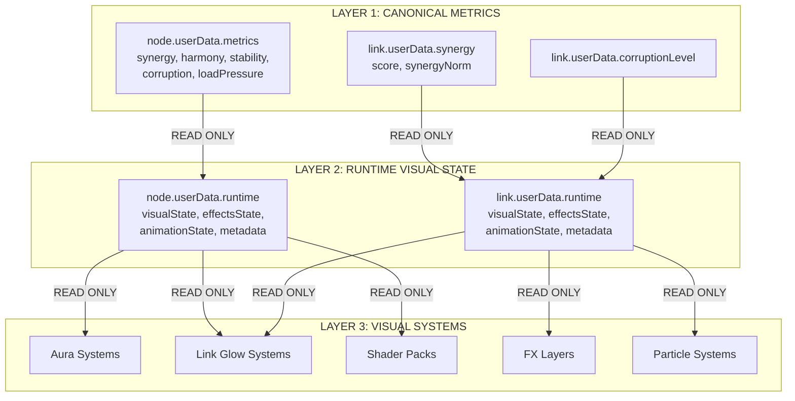

# ATOMA METRIC SOURCE NORMALIZATION PLAN

**Risk Level:** Class B - Systemic Change
**Date:** 2026-03-13
**Status:** Architecture Proposal

---

## EXECUTIVE SUMMARY

This plan proposes a comprehensive normalization of ATOMA's metrics architecture to eliminate legacy field usage and establish clear separation between canonical metrics (gameplay truth) and runtime visual state (presentation layer).

**Key Goals:**
1. Unify all visual/gameplay systems to read metrics ONLY from canonical metrics layer
2. Define clear runtime visual state structure (`node.userData.runtime.*` and `link.userData.runtime.*`)
3. Remove all legacy compatibility fields
4. Establish single-writer authority for each metric type

---

## CURRENT STATE ANALYSIS

### Legacy Field Usage (TO REMOVE)

#### Node Legacy Fields
```javascript
// ❌ FORBIDDEN - Direct legacy field access
node.userData.synergy
node.userData.harmony
node.userData.stability
node.userData.corruption
node.userData.loadPressure
```

**Found in 36 locations:**
- `CriticalNodeFailureSystem.js` (reads corruption)
- `HarmonyStabilizationSystem_v1.js` (reads/writes corruption, harmonyLevel)
- `EXAMPLES/LINK_CORRUPTION_TRANSMISSION_v1_EXAMPLES.js` (writes corruption)
- `EXAMPLES/HARMONY_STABILIZATION_v1_EXAMPLES.js` (writes corruption)
- `NetworkRituals_v1.js` (reads/writes harmonyLevel)
- `NodeLinkingSystem.js` (reads/writes harmonyStabilized, harmonyDampingFactor)
- `NodeVisualStateBinder.js` (reads/writes synergyPulseActive, synergyScore)
- `src/legacy/T2_HarmonyVisualConsumer_v1.js` (reads harmonyLevel)
- `src/utils/nodeCorruptionAccessor.js` (writes corruption)
- `T4004_HARMONY_HEALING_TEST_RUNNER.js` (writes corruption)

#### Link Legacy Fields
```javascript
// ❌ FORBIDDEN - Direct legacy field access
link.synergy
link.synergyScore
link.synergyLevel
link.synergy2_1
link.corruption
link.corruptionLevel
link.corruptionIntensity
link.stability
link.harmony
link.instability
link.flow
```

**Found in 80+ locations:**
- `LinkCorruptionTransmission_v1.js` (reads/writes synergy, corruptionLevel)
- `NodeLinkingSystem.js` (reads/writes synergyScore, corruptionLevel)
- `HarmonyStabilizationSystem_v1.js` (reads synergy)
- `ComputeSynergyScore2_1.js` (writes synergy)
- `LinkGlowSynergyEngine_v2.js` (reads synergy)
- `LinkResonanceFlowSystem_Session124.js` (reads synergy)
- `LinkPrioritySystem.js` (reads synergy)
- `MegaGlyphSystem.js` (reads synergy, corruption)
- Multiple EXAMPLES files

### Visual/Runtime State Patterns (TO NORMALIZE)

#### Node Visual State
```javascript
// ✅ GOOD - Already structured
node.userData.visualMetrics.* // Canonical visual metrics
node.userData.harmonyVisualState.* // Harmony-specific visual state
node.userData.corruptionVisualState.* // Corruption-specific visual state

// ⚠️ NEEDS NORMALIZATION - Scattered runtime state
node.userData.synergyPulseActive
node.userData.synergyScore
node.userData.lastPulseTime
node.userData.harmonyStabilized
node.userData.harmonyDampingFactor
node.userData.visualRoot
node.userData.visualType
node.userData.visualLocked
node.userData.visualReady
node.userData.visualCode
node.userData.visualProfile
node.userData.visualCoreImmutable
```

#### Link Visual State
```javascript
// ✅ GOOD - Already structured
link.userData.visualMetrics.* // Canonical visual metrics
link.userData.visualGlow.* // Glow-specific visual state
link.userData.corruptionVisualState.* // Corruption-specific visual state

// ⚠️ NEEDS NORMALIZATION - Scattered runtime state
link.userData.synergyCollapse
link.userData.synergyCascadeTime
link.userData.visualIntensity
link.userData.visualTear
link.userData.visualCoherenceLoss
link.userData.visualStrain
```

---

## PROPOSED ARCHITECTURE

### Three-Layer Metrics Model



### Canonical Metrics Layer (READ-WRITE)

```javascript
// ✅ CANONICAL NODE METRICS
node.userData.metrics = {
  synergy: 0..1,        // Network connection quality
  harmony: 0..1,        // Internal coherence
  stability: 0..1,      // Resistance to change
  corruption: 0..1,     // Entropy/decay level
  loadPressure: 0..1    // System pressure
}

// ✅ CANONICAL LINK METRICS
link.userData.synergy = {
  score: 0..1,          // Raw synergy score
  synergyNorm: 0..1     // Normalized synergy
}

link.userData.corruptionLevel = 0..1  // Link corruption state
```

**Canonical Writers (SINGLE WRITER LAW):**
- `NodeMetricEngine` → node metrics (event impulses)
- `MetricsRuntime_v1` → node metrics (10Hz relaxation)
- `SafeMetricsDNAIntegration` → node metrics (spawn only)
- `ComputeSynergyScore2_1` → link.userData.synergy
- `LinkCorruptionTransmission_v1` → link.userData.corruptionLevel

### Runtime Visual State Layer (READ-WRITE)

```javascript
// ✅ RUNTIME VISUAL STATE - NODES
node.userData.runtime = {
  // Visual state management
  visualState: {
    ready: boolean,
    readyAt: timestamp,
    applied: boolean,
    appliedAt: timestamp,
    restoredAt: timestamp
  },
  
  // Effects state (transient visual effects)
  effectsState: {
    synergyPulse: {
      active: boolean,
      score: number,
      lastPulseTime: timestamp
    },
    harmonyStabilized: {
      active: boolean,
      dampingFactor: number
    },
    corruptionVisual: {
      colorTint: {r, g, b},
      intensity: number
    },
    harmonyVisual: {
      auraTint: {r, g, b},
      intensity: number
    }
  },
  
  // Animation state (motion, transitions)
  animationState: {
    bobPhase: number,
    destabilization: number,
    tearPhase: number
  },
  
  // Metadata (system-specific flags)
  metadata: {
    visualRoot: THREE.Object3D,
    visualType: string,
    visualLocked: boolean,
    visualCode: number,
    visualProfile: object,
    visualCoreImmutable: boolean
  }
}

// ✅ RUNTIME VISUAL STATE - LINKS
link.userData.runtime = {
  // Visual state management
  visualState: {
    intensity: number,
    corruptionLevel: number
  },
  
  // Effects state (transient visual effects)
  effectsState: {
    synergyCollapse: {
      active: boolean,
      cascadeTime: timestamp
    },
    corruptionVisual: {
      colorTint: {r, g, b},
      wavePhase: number,
      waveIntensity: number
    },
    glow: {
      glowIntensity: number,
      qualityNorm: number,
      corruptionPulse: number
    }
  },
  
  // Animation state (motion, transitions)
  animationState: {
    tearPhase: number,
    coherenceLoss: number,
    strainIntensity: number
  },
  
  // Metadata (system-specific flags)
  metadata: {
    // Future expansion
  }
}
```

**Runtime State Writers:**
- Visual systems (aura, glow, FX) → `node.userData.runtime.effectsState.*`
- Animation systems → `node.userData.runtime.animationState.*`
- Visual authority systems → `node.userData.runtime.metadata.*`
- Link visual systems → `link.userData.runtime.effectsState.*`

### Visual Metrics Layer (DERIVED, READ-ONLY)

```javascript
// ✅ DERIVED VISUAL METRICS - NODES
node.userData.visualMetrics = {
  corruptionIntensity: 0..1,
  integrityHealth: 0..1,
  harmonyAuraStrength: 0..1,
  synergyGlowIntensity: 0..1,
  networkStressVisualDensity: 0..1,
  nodeVitalityScore: 0..1
}

// ✅ DERIVED VISUAL METRICS - LINKS
link.userData.visualMetrics = {
  synergyBonus: {
    tier: 0..3,
    pulseStrength: 0..1,
    chromaShift: 0..1,
    resonanceRipples: 0..1
  }
}
```

**Visual Metrics Writers:**
- `MetricInterpretationLayer_v1` → node.userData.visualMetrics
- `VisualMetricModel_v1` → node.userData.visualMetrics, link.userData.visualMetrics
- `SynergyBonusVisualization_v1` → link.userData.visualMetrics.synergyBonus

---

## MIGRATION STRATEGY

### Phase 1: Adapter Layer (Backward Compatibility)

Create adapter functions to provide seamless migration:

```javascript
// src/metrics/MetricRuntimeAdapter.js

/**
 * Adapter for legacy node metric reads
 * Provides backward compatibility during migration
 */
export class NodeMetricRuntimeAdapter {
  /**
   * Get canonical metric with fallback to legacy
   * @param {THREE.Object3D} node - Node object
   * @param {string} metric - Metric name (synergy, harmony, etc.)
   * @returns {number} Metric value
   */
  static getMetric(node, metric) {
    // Try canonical first
    if (node?.userData?.metrics?.[metric] !== undefined) {
      return node.userData.metrics[metric];
    }
    
    // Fallback to legacy (with deprecation warning)
    if (node?.userData?.[metric] !== undefined) {
      console.warn(
        `[NodeMetricRuntimeAdapter] Legacy field access: node.userData.${metric}. ` +
        `Use node.userData.metrics.${metric} instead.`
      );
      return node.userData[metric];
    }
    
    return 0;
  }
  
  /**
   * Get runtime visual state
   * @param {THREE.Object3D} node - Node object
   * @param {string} path - Runtime state path (e.g., 'effectsState.synergyPulse.active')
   * @returns {*} Runtime state value
   */
  static getRuntimeState(node, path) {
    const parts = path.split('.');
    let current = node?.userData?.runtime;
    
    for (const part of parts) {
      if (!current) return undefined;
      current = current[part];
    }
    
    return current;
  }
  
  /**
   * Set runtime visual state
   * @param {THREE.Object3D} node - Node object
   * @param {string} path - Runtime state path
   * @param {*} value - Value to set
   */
  static setRuntimeState(node, path, value) {
    if (!node.userData) node.userData = {};
    if (!node.userData.runtime) node.userData.runtime = {};
    
    const parts = path.split('.');
    let current = node.userData.runtime;
    
    for (let i = 0; i < parts.length - 1; i++) {
      if (!current[parts[i]]) current[parts[i]] = {};
      current = current[parts[i]];
    }
    
    current[parts[parts.length - 1]] = value;
  }
}

/**
 * Adapter for legacy link metric reads
 */
export class LinkMetricRuntimeAdapter {
  /**
   * Get canonical synergy with fallback
   */
  static getSynergy(link) {
    if (link?.userData?.synergy?.score !== undefined) {
      return link.userData.synergy.score;
    }
    
    if (link?.userData?.synergy?.synergyNorm !== undefined) {
      return link.userData.synergy.synergyNorm;
    }
    
    // Legacy fallbacks
    if (link?.synergyScore !== undefined) {
      console.warn('[LinkMetricRuntimeAdapter] Legacy field: link.synergyScore. Use link.userData.synergy.score');
      return link.synergyScore;
    }
    
    if (link?.synergy !== undefined) {
      console.warn('[LinkMetricRuntimeAdapter] Legacy field: link.synergy. Use link.userData.synergy');
      return link.synergy;
    }
    
    return 0.5;
  }
  
  /**
   * Get corruption level with fallback
   */
  static getCorruption(link) {
    if (link?.userData?.corruptionLevel !== undefined) {
      return link.userData.corruptionLevel;
    }
    
    // Legacy fallbacks
    if (link?.corruption !== undefined) {
      console.warn('[LinkMetricRuntimeAdapter] Legacy field: link.corruption. Use link.userData.corruptionLevel');
      return link.corruption;
    }
    
    if (link?.corruptionIntensity !== undefined) {
      console.warn('[LinkMetricRuntimeAdapter] Legacy field: link.corruptionIntensity. Use link.userData.corruptionLevel');
      return link.corruptionIntensity;
    }
    
    return 0;
  }
  
  /**
   * Get runtime visual state
   */
  static getRuntimeState(link, path) {
    const parts = path.split('.');
    let current = link?.userData?.runtime;
    
    for (const part of parts) {
      if (!current) return undefined;
      current = current[part];
    }
    
    return current;
  }
  
  /**
   * Set runtime visual state
   */
  static setRuntimeState(link, path, value) {
    if (!link.userData) link.userData = {};
    if (!link.userData.runtime) link.userData.runtime = {};
    
    const parts = path.split('.');
    let current = link.userData.runtime;
    
    for (let i = 0; i < parts.length - 1; i++) {
      if (!current[parts[i]]) current[parts[i]] = {};
      current = current[parts[i]];
    }
    
    current[parts[parts.length - 1]] = value;
  }
}
```

### Phase 2: System-by-System Migration

**Migration Priority:**

1. **HIGH PRIORITY** (Critical systems, high usage)
   - `HarmonyStabilizationSystem_v1.js`
   - `LinkCorruptionTransmission_v1.js`
   - `NodeLinkingSystem.js`
   - `NodeVisualStateBinder.js`

2. **MEDIUM PRIORITY** (Visual systems)
   - `LinkGlowSynergyEngine_v2.js`
   - `LinkResonanceFlowSystem_Session124.js`
   - `HarmonyAuraController.js`
   - `CorruptionVisualFX_v1.js`

3. **LOW PRIORITY** (Examples, test files)
   - All `EXAMPLES/*.js` files
   - `T4004_HARMONY_HEALING_TEST_RUNNER.js`
   - Legacy systems in `LEGACY/` and `src/legacy/`

### Phase 3: Legacy Field Removal

After all systems are migrated:

1. Add runtime validation to detect legacy field access
2. Remove legacy field writes
3. Deprecate legacy field reads (with warnings)
4. Eventually remove legacy fields entirely

---

## FORBIDDEN PATTERNS

### ❌ FORBIDDEN: Direct Legacy Field Access

```javascript
// ❌ NEVER DO THIS
const synergy = node.userData.synergy;
const corruption = node.userData.corruption;
const harmony = node.userData.harmony;

// ❌ NEVER DO THIS
const linkSynergy = link.synergy;
const linkCorruption = link.corruption;
const linkScore = link.synergyScore;
```

### ❌ FORBIDDEN: Visual Systems Writing Canonical Metrics

```javascript
// ❌ NEVER DO THIS - Visual systems must be READ-ONLY
node.userData.metrics.synergy = 0.5;
node.userData.metrics.harmony = 0.8;
link.userData.synergy.score = 0.7;
```

### ❌ FORBIDDEN: Scattered Runtime State

```javascript
// ❌ NEVER DO THIS - Scattered runtime state
node.userData.synergyPulseActive = true;
node.userData.synergyScore = 0.8;
node.userData.lastPulseTime = Date.now();
node.userData.harmonyStabilized = true;
node.userData.harmonyDampingFactor = 0.2;
```

---

## ALLOWED PATTERNS

### ✅ ALLOWED: Canonical Metric Reads (Visual Systems)

```javascript
// ✅ CORRECT - Read from canonical metrics
const synergy = node.userData.metrics.synergy;
const corruption = node.userData.metrics.corruption;
const harmony = node.userData.metrics.harmony;

// ✅ CORRECT - Read from canonical link metrics
const linkSynergy = link.userData.synergy.score;
const linkCorruption = link.userData.corruptionLevel;
```

### ✅ ALLOWED: Runtime Visual State Writes (Visual Systems)

```javascript
// ✅ CORRECT - Write to runtime visual state
NodeMetricRuntimeAdapter.setRuntimeState(node, 'effectsState.synergyPulse.active', true);
NodeMetricRuntimeAdapter.setRuntimeState(node, 'effectsState.synergyPulse.score', synergy);
NodeMetricRuntimeAdapter.setRuntimeState(node, 'effectsState.synergyPulse.lastPulseTime', Date.now());

NodeMetricRuntimeAdapter.setRuntimeState(node, 'effectsState.harmonyStabilized.active', true);
NodeMetricRuntimeAdapter.setRuntimeState(node, 'effectsState.harmonyStabilized.dampingFactor', 0.2);

// ✅ CORRECT - Write to link runtime state
LinkMetricRuntimeAdapter.setRuntimeState(link, 'effectsState.synergyCollapse.active', true);
LinkMetricRuntimeAdapter.setRuntimeState(link, 'effectsState.synergyCollapse.cascadeTime', Date.now());
```

### ✅ ALLOWED: Runtime Visual State Reads (Visual Systems)

```javascript
// ✅ CORRECT - Read from runtime visual state
const pulseActive = NodeMetricRuntimeAdapter.getRuntimeState(node, 'effectsState.synergyPulse.active');
const pulseScore = NodeMetricRuntimeAdapter.getRuntimeState(node, 'effectsState.synergyPulse.score');

const collapseActive = LinkMetricRuntimeAdapter.getRuntimeState(link, 'effectsState.synergyCollapse.active');
```

### ✅ ALLOWED: Visual Metrics Reads (Visual Systems)

```javascript
// ✅ CORRECT - Read from derived visual metrics
const visualCorruption = node.userData.visualMetrics.corruptionIntensity;
const visualHarmony = node.userData.visualMetrics.harmonyAuraStrength;

const synergyBonus = link.userData.visualMetrics.synergyBonus;
```

---

## IMPLEMENTATION ROADMAP

### Phase 1: Foundation (Week 1)
- [ ] Create `MetricRuntimeAdapter.js` with node and link adapters
- [ ] Define `node.userData.runtime.*` structure
- [ ] Define `link.userData.runtime.*` structure
- [ ] Add adapter to main.js initialization
- [ ] Create migration utility functions

### Phase 2: High-Priority Systems (Week 2-3)
- [ ] Migrate `HarmonyStabilizationSystem_v1.js`
  - Replace `node.userData.corruption` → `node.userData.metrics.corruption`
  - Replace `node.userData.harmonyLevel` → `node.userData.metrics.harmony`
  - Replace scattered visual state → `node.userData.runtime.effectsState.*`
- [ ] Migrate `LinkCorruptionTransmission_v1.js`
  - Replace `link.userData.synergy.score` reads (already correct)
  - Replace scattered visual state → `link.userData.runtime.effectsState.*`
- [ ] Migrate `NodeLinkingSystem.js`
  - Replace `link['synergyScore']` → `link.userData.synergy.score`
  - Replace `link.corruptionLevel` → `link.userData.corruptionLevel` (already correct)
  - Replace scattered visual state → `node.userData.runtime.*`
- [ ] Migrate `NodeVisualStateBinder.js`
  - Replace scattered visual state → `node.userData.runtime.effectsState.*`

### Phase 3: Medium-Priority Systems (Week 4-5)
- [ ] Migrate `LinkGlowSynergyEngine_v2.js`
- [ ] Migrate `LinkResonanceFlowSystem_Session124.js`
- [ ] Migrate `HarmonyAuraController.js`
- [ ] Migrate `CorruptionVisualFX_v1.js`
- [ ] Migrate other visual systems

### Phase 4: Low-Priority Systems (Week 6)
- [ ] Migrate all EXAMPLES files
- [ ] Migrate test files
- [ ] Migrate legacy systems
- [ ] Update documentation

### Phase 5: Validation & Cleanup (Week 7)
- [ ] Add runtime validation to detect legacy field access
- [ ] Remove legacy field writes
- [ ] Add deprecation warnings for legacy reads
- [ ] Update all documentation
- [ ] Create migration guide

### Phase 6: Final Cleanup (Week 8)
- [ ] Remove legacy fields entirely
- [ ] Remove adapter (if desired)
- [ ] Final testing and verification

---

## TESTING STRATEGY

### Unit Tests
- Test adapter functions with canonical and legacy inputs
- Test runtime state get/set operations
- Test migration utility functions

### Integration Tests
- Test migrated systems with adapter layer
- Test visual systems reading from canonical metrics
- Test runtime state management

### Validation Tests
- Detect legacy field access at runtime
- Validate canonical metric range (0..1)
- Validate runtime state structure

---

## RISK MITIGATION

### High-Risk Areas
1. **HarmonyStabilizationSystem_v1.js** - Critical gameplay system
   - Mitigation: Extensive testing, gradual migration
2. **LinkCorruptionTransmission_v1.js** - Critical corruption system
   - Mitigation: Preserve existing behavior, add validation
3. **NodeLinkingSystem.js** - Core linking system
   - Mitigation: Careful testing of link creation/deletion

### Rollback Strategy
- Keep adapter layer indefinitely for backward compatibility
- Use feature flags to enable/disable migration
- Maintain legacy field reads with deprecation warnings

---

## SUCCESS CRITERIA

### Phase 1 Success
- [ ] Adapter layer created and tested
- [ ] Runtime state structure defined
- [ ] No breaking changes to existing systems

### Phase 2 Success
- [ ] High-priority systems migrated
- [ ] All legacy field writes removed
- [ ] No visual or gameplay regressions

### Phase 3 Success
- [ ] All visual systems migrated
- [ ] All legacy field writes removed
- [ ] Visual quality maintained or improved

### Phase 4 Success
- [ ] All systems migrated
- [ ] Legacy fields deprecated
- [ ] Documentation updated

### Final Success
- [ ] No legacy field access in codebase
- [ ] All systems use canonical metrics
- [ ] Runtime visual state properly structured
- [ ] No performance degradation
- [ ] No visual or gameplay regressions

---

## OPEN QUESTIONS

1. **Adapter Retention:** Should we keep the adapter layer indefinitely for backward compatibility, or remove it after migration is complete?

2. **Legacy Field Removal:** Should we remove legacy fields entirely in Phase 6, or keep them with deprecation warnings for a transition period?

3. **Runtime State Granularity:** Is the proposed `node.userData.runtime.*` structure too granular? Should we simplify it?

4. **Performance Impact:** Will the adapter layer introduce measurable performance overhead? Should we optimize it?

---

## REFERENCES

- `docs/contracts/MetricsAuthority.contact.md` - Canonical metric definitions
- `docs/AUDITS - metrics/METRICS ARCHITECTURAL MAP.md` - Current architecture
- `docs/AUDITS - metrics/ATOMA METRICS CLEAN MAP.md` - Clean map proposal
- `MetricsRuntime_v1.js` - Metrics runtime orchestration
- `MetricInterpretationLayer_v1.js` - Visual metrics computation

---

**END OF PLAN**
