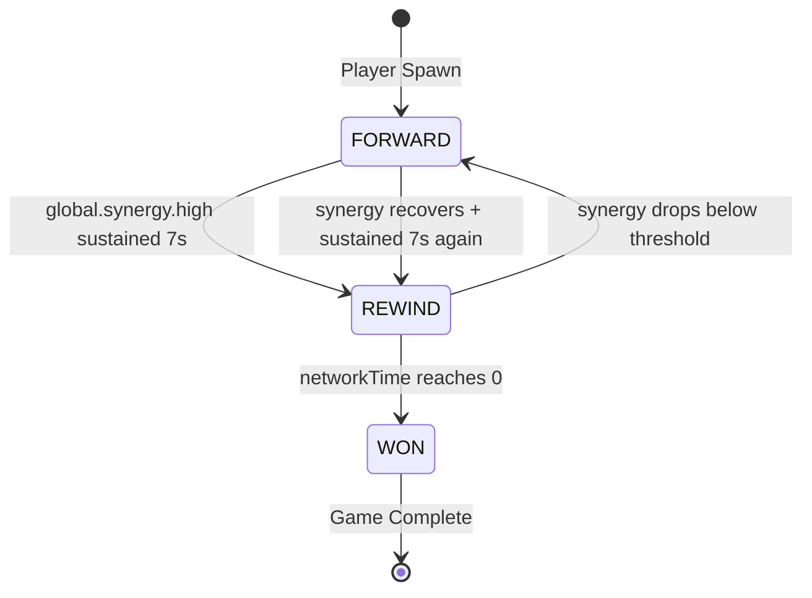
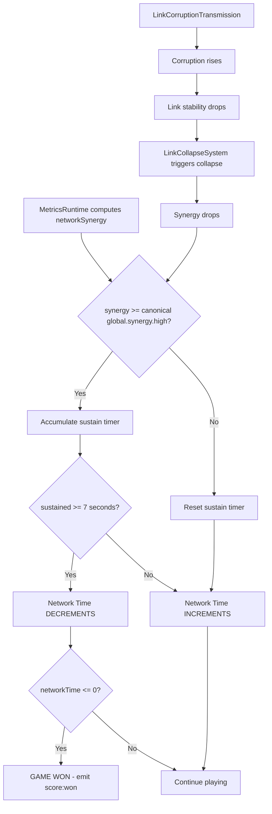

# Network Time Score — Gameplay Architecture Plan

> Status note (2026-05-06): this file is a historical implementation plan. Current runtime no longer matches all values here.
> Current live truth is documented in `docs/audits/NETWORK_TIME_GAMEPLAY_BALANCE_AUDIT_2026-05-06.md`.
> Key drift: runtime uses `5s` sustain and raw `MetricsRuntime_v1.getRawNetworkMetrics().networkSynergy`, not the older `7s` plan below.

## Goal

Turn **Network Time** from a passive display counter into the **core gameplay score**:
- Network Time counts **UP** from spawn (pressure — the longer you take, the higher the score to beat)
- When `global.synergy.high` is sustained for **7 seconds**, Network Time counts **DOWN** (reward)
- If synergy drops, Network Time resumes counting **UP** (risk)
- **Win condition**: Network Time reaches **0** → game successfully completed
- **Challenge**: corruption, instability, link collapse make sustaining synergy difficult

---

## Current State Analysis

### What exists and what role it plays:

| File | Current Role | Status |
|------|-------------|--------|
| `VisualNetworkTimeElasticity_v1.js` | Network Time score authority with 7s sustain on canonical `global.synergy.high` | **Implemented** — gameplay score authority |
| `CoreMetricsHUD.js` | Displays score-system Network Time and canonical core metrics | **Implemented** — reads from score system |
| `TemporalUnitSystem.js` | Cycle/Epoch/Aeon naming — only goes forward | **Minor update** — integrate with network time direction |
| `LinkCollapseSystem.js` | Links collapse when corruption.high + stability.low persist | **No changes** — already provides the challenge |
| `LinkCorruptionTransmission_v1.js` | Full corruption system with healing, barriers, resonance | **No changes** — already provides the challenge |
| `MetricsRuntime_v1.js` | Computes `networkSynergy`, emits `global.synergy.high` tier signals | **No changes** — already provides the trigger |
| `main.js` | Wires systems together, runs simulation loop | **Update** — wire score system events |

### Key insight
All the **challenge systems** (corruption, collapse, instability) already exist and work. The missing piece is the **score logic** that ties Network Time direction to sustained synergy.

---

## Architecture: Refactored System

### Core Concept: Network Time Direction States

```
FORWARD (default)     → Network Time increments (pressure)
REWIND (synergy high) → Network Time decrements (reward)
WON                   → Network Time reached 0 (victory)
```

### State Machine



### Flow Diagram



---

## Implementation Plan — File by File

### 1. Refactor `VisualNetworkTimeElasticity_v1.js` → Gameplay Score Authority

**This is the main change.** The file already has:
- Synergy threshold tracking
- Sustain timer
- Time reversal concept
- Wired into main.js simulation loop at 10Hz

**Changes:**

#### a) Add Network Time Counter
- Move `networkTimeCounter` from CoreMetricsHUD into this system
- Counter starts at 0, increments at 5 units/sec when FORWARD
- Counter decrements at configurable rate when REWINDING
- Counter cannot go below 0

#### b) Change sustain duration
- `_sustainDuration`: 5.0 → **7.0** seconds

#### c) Add score direction state
- `_direction`: `FORWARD` | `REWIND` | `WON`
- Public getter: `getDirection()`, `getNetworkTime()`, `isWon()`

#### d) Add rewind speed for counter
- `_rewindCountSpeed`: units per second to decrement (e.g., 3 units/sec)
- This is separate from the visual rewind speed

#### e) Emit gameplay events
- `score:forward` — Network Time starts counting up
- `score:rewinding` — Network Time starts counting down
- `score:won` — Network Time reached 0
- Use semanticBus if available, fallback to simple callbacks

#### f) Keep visual time elasticity as sub-feature
- The existing `_visualTime` rewind for animations stays
- It now activates alongside the score rewind
- Visual rewind speed can differ from score rewind speed

#### g) Add reset method
- For game restart / new game

### 2. Update `CoreMetricsHUD.js` — Read from Score System

**Remove local counter logic, delegate to score system.**

#### a) Remove local state
- Remove `networkTimeCounter`, `networkTimeFrozen`, `networkTimePulseActive`, `networkTimePulseElapsed`
- Remove `updateNetworkTime()` method body — replace with read from score system

#### b) Accept score system reference
- Constructor or setter takes the score system instance
- `setScoreSystem(scoreSystem)` method

#### c) Update display logic
- Read `scoreSystem.getNetworkTime()` for the counter value
- Read `scoreSystem.getDirection()` for state (FORWARD/REWIND/WON)
- CSS classes: `.forward`, `.rewinding`, `.won` instead of `.frozen`
- Show direction badge: FORWARD = nothing, REWIND = ELASTIC badge, WON = victory glow

#### d) Remove local VisualNetworkTimeElasticity import
- The HUD no longer creates its own instance
- It reads from the single score system instance

### 3. Update `main.js` — Wire Score System

#### a) Score system is already created
- `this.visualNetworkTimeElasticity` already exists in main.js
- After refactor, it becomes the score authority
- Rename reference: `this.visualNetworkTimeElasticity` → `this.networkTimeScore` (optional, for clarity)

#### b) Wire score events
- Listen for `score:won` event
- Trigger game completion: pause simulation, show victory overlay, etc.

#### c) Pass score system to CoreMetricsHUD
- After HUD creation: `this.coreMetricsHUD.setScoreSystem(this.networkTimeScore)`

#### d) Update CoreMetricsOverlay if needed
- `CoreMetricsOverlay.js` also creates a `CoreMetricsHUD` — needs the same wiring

### 4. Minor: Update `TemporalUnitSystem.js` (Optional)

- Could integrate network time direction into temporal display
- e.g., show REWIND indicator when time is going backward
- Low priority — can be done later

---

## Configuration Constants — CONFIRMED

```javascript
// In the refactored score system
SCORE_CONFIG = {
  forwardSpeed: 5,          // units per second counting up
  rewindSpeed: 3,           // units per second counting down (slower = harder)
  synergyThreshold: getDefaultMetricThresholds('synergy').high,
  sustainDuration: 7.0,     // seconds of sustained high synergy before rewind
  fadeInDuration: 1.0,      // visual fade in
  fadeOutDuration: 1.0,     // visual fade out
  visualRewindSpeed: 0.4,   // visual animation rewind speed
  startValue: 0,            // starting network time — must accumulate before rewinding
  minDisplayDigits: 5,      // pad to 5 digits for display
}
```

### Confirmed Design Decisions
- **Rewind speed**: 3 units/sec (slower than forward 5/sec — makes it harder)
- **Win condition**: Freeze simulation + victory overlay
- **Game over**: None — player can try forever
- **Synergy threshold**: canonical `global.synergy.high` from `MetricTierClassifier` (`0.45` at the time of the 2026-04-28 audit)
- **Start at 0**: Player must first accumulate time before they can rewind it

---

## Integration Points — What Already Works

### Challenge Loop (already functional)
1. `LinkCorruptionTransmission_v1` raises corruption on links
2. `LinkCollapseSystem` detects corruption.high + stability.low → collapses links
3. Collapsed links reduce network synergy
4. `MetricsRuntime` computes `networkSynergy` from surviving links
5. If synergy drops → sustain timer resets → Network Time goes FORWARD again

### Trigger Loop (already functional)
1. `MetricsRuntime` emits `global.synergy.high` when `networkSynergy >= MetricTierClassifier.synergy.high`
2. Score system reads `networkSynergy` each frame
3. Sustain timer accumulates while synergy is high
4. After 7 seconds sustained → Network Time REWIND

### Display Loop (needs update)
1. Score system computes Network Time value + direction
2. CoreMetricsHUD reads from score system
3. HUD renders: counter value + direction indicator + state styling

---

## Risk Assessment

| Risk | Mitigation |
|------|-----------|
| Breaking existing visual time elasticity | Keep visual time as sub-feature, add score logic alongside |
| HUD shows wrong values during refactor | Incremental: first add score system, then update HUD to read from it |
| Win condition triggers too early | Start Network Time at a reasonable value, tune rewind speed |
| Synergy sustain too easy/hard | Configurable sustain duration and thresholds |
| Multiple instances of score system | Single instance in main.js, passed by reference |

---

## Files Changed Summary

| File | Change Type | Scope |
|------|------------|-------|
| `VisualNetworkTimeElasticity_v1.js` | **Major refactor** | Add score counter, direction state, events, 7s sustain |
| `HUD/CoreMetricsHUD.js` | **Medium refactor** | Remove local counter, read from score system |
| `main.js` | **Minor update** | Wire score events, pass system to HUD |
| `HUD/CoreMetricsOverlay.js` | **Minor update** | Pass score system to CoreMetricsHUD |
| `TemporalUnitSystem.js` | **Optional** | Integrate direction display |

**No new files created.** All changes are refactors of existing files.

---

## Resolved Design Decisions

1. **Starting Network Time**: Starts at 0, counts up at 5/sec. Player must first accumulate time before rewinding.
2. **Rewind speed**: 3 units/sec (slower than forward — intentional difficulty).
3. **Win condition**: Freeze simulation + victory overlay when Network Time reaches 0.
4. **Game over**: No game over — player can try forever.
5. **Synergy threshold**: canonical `global.synergy.high` from `MetricTierClassifier`, not a private hardcoded value.
6. **Temporal naming**: Cycle/Epoch/Aeon stays as-is. Network Time is the separate score counter.
