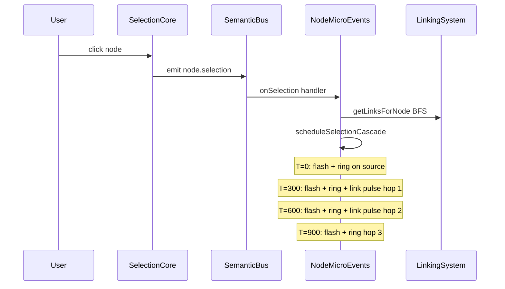
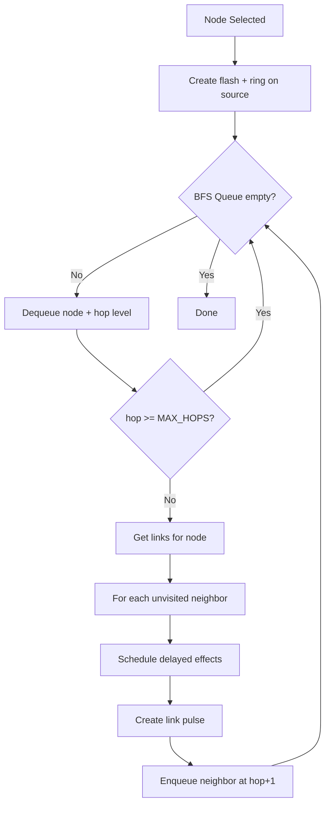

# Selection Resonance Cascade — Detailed Implementation Plan

**Date:** 2026-04-20
**Status:** PLANNING
**Scope:** MEDIUM — changes within `_NodeMicroEvents.js` only
**Impact:** VERY HIGH — transforms node selection into topology exploration

---

## Concept Visualization

```
T=0ms    T=300ms         T=600ms           T=900ms
         
 [A]●──────●[B]──────────●[D]
  ╲         ╲
   ╲         ╲
    ●[C]      ●[E]──────●[F]
    
 ● = ring flash    ── = link pulse traveling

Hop 0: Node A (selected) — BRIGHT white-cyan flash + expanding ring
Hop 1: Nodes B, C — cyan ring (300ms delay) + link pulse from A
Hop 2: Nodes D, E — teal ring (600ms delay) + link pulse from B,C  
Hop 3: Node F — dim teal ring (900ms delay) + link pulse from E
```

---

## Visual Elements

### 1. Selection Ring — expanding ring at each reached node
Like existing `resonance_halo` but with hop-dependent color and intensity:
- **Hop 0** (selected node): bright white-cyan `#ccffff`, opacity 0.8, duration 1.5s
- **Hop 1**: cyan `#00ccff`, opacity 0.5, duration 1.2s
- **Hop 2**: teal `#00aa99`, opacity 0.3, duration 1.0s
- **Hop 3**: dim teal `#006666`, opacity 0.15, duration 0.8s

Each ring expands outward and fades. An echo ring follows 150ms behind at 50% opacity.

### 2. Node Flash — brief emissive spike on reached node
A quick brightness pulse (200ms) on the node material's emissive intensity. Intensity scales with hop:
- Hop 0: +0.6 emissive
- Hop 1: +0.3 emissive
- Hop 2: +0.15 emissive
- Hop 3: +0.08 emissive

### 3. Link Pulse — bright dot traveling along the link
A small glowing sphere that travels from source node to target node along the link path. Shows the CONNECTION direction. Duration ~300ms per link. Color matches the destination hop color.

---

## Architecture

### Data Flow



### BFS Traversal



---

## Implementation Steps

### Step 1: Add selection cascade config to `_NodeMicroEvents` constructor

Add to `this.config` in constructor (after line 120):

```js
// Selection resonance cascade
selectionCascade: {
  enabled: true,
  maxHops: 3,
  hopDelayMs: 300,         // ms between each hop level
  maxAffectedNodes: 20,    // safety cap
  cooldownMs: 2000,        // don't re-trigger within 2s
  colors: [0xccffff, 0x00ccff, 0x00aa99, 0x006666],
  ringOpacities: [0.8, 0.5, 0.3, 0.15],
  ringDurations: [1.5, 1.2, 1.0, 0.8],
  flashIntensities: [0.6, 0.3, 0.15, 0.08],
  linkPulseSpeed: 3.0,     // units per second
  linkPulseSize: 0.06,
}
```

### Step 2: Add state tracking for cascade cooldown

Add after `this._elapsedTime = 0` (line 84):

```js
// Selection cascade state
this._lastSelectionCascadeTime = 0;
this._selectionCascadeTimers = []; // for cleanup on dispose
```

### Step 3: Subscribe to `node.selection` semantic event

Add new method `_setupSelectionCascadeSubscription()`:

```js
_setupSelectionCascadeSubscription() {
  const bus = this._resolveMetricBus();
  if (!bus?.on) return;
  
  const handler = (payload) => {
    if (payload?.type !== 'select') return;
    const node = this._resolveNodeById(payload.nodeId);
    if (!node) return;
    this.triggerSelectionCascade(node);
  };
  
  bus.on('node.selection', handler);
  this._semanticSubscriptions = this._semanticSubscriptions || [];
  this._semanticSubscriptions.push(['node.selection', handler]);
}
```

Call this at end of constructor.

### Step 4: Add `_resolveNodeById` helper

Already exists at line 103-119. Reuse it.

### Step 5: Add `_getLinksForNode` helper

Access linking system via globalThis (consistent with existing `_resolveMetricBus` pattern):

```js
_getLinkingSystem() {
  return globalThis?.game?.linkingSystem || null;
}

_getLinksForNode(node) {
  const ls = this._getLinkingSystem();
  if (ls?.getLinksForNode) return ls.getLinksForNode(node);
  // Fallback: read from node userData
  return node?.userData?.links || [];
}
```

### Step 6: Implement `triggerSelectionCascade(node)` — the main method

```js
triggerSelectionCascade(sourceNode) {
  if (!sourceNode) return;
  
  const cfg = this.config.selectionCascade;
  if (!cfg.enabled) return;
  
  // Cooldown check
  const now = Date.now();
  if (now - this._lastSelectionCascadeTime < cfg.cooldownMs) return;
  this._lastSelectionCascadeTime = now;
  
  // BFS traversal through links
  const visited = new Set();
  visited.add(sourceNode.uuid);
  const hopSchedule = []; // { node, hop, sourceNode, link }
  
  const queue = [{ node: sourceNode, hop: 0 }];
  let totalAffected = 0;
  
  while (queue.length > 0 && totalAffected < cfg.maxAffectedNodes) {
    const { node, hop } = queue.shift();
    if (hop > cfg.maxHops) continue;
    
    // Schedule effects for this node at this hop
    hopSchedule.push({ node, hop });
    totalAffected++;
    
    if (hop >= cfg.maxHops) continue;
    
    // Find connected neighbors
    const links = this._getLinksForNode(node);
    for (const link of links) {
      const neighbor = (link.source === node) ? link.target
                     : (link.target === node) ? link.source
                     : null;
      if (!neighbor || visited.has(neighbor.uuid)) continue;
      visited.add(neighbor.uuid);
      
      // Schedule link pulse from node to neighbor
      hopSchedule.push({ 
        node: neighbor, 
        hop: hop + 1, 
        fromNode: node, 
        link 
      });
      
      queue.push({ node: neighbor, hop: hop + 1 });
    }
  }
  
  // Execute scheduled effects with delays
  for (const item of hopSchedule) {
    const delay = item.hop * cfg.hopDelayMs;
    const color = cfg.colors[Math.min(item.hop, cfg.colors.length - 1)];
    const opacity = cfg.ringOpacities[Math.min(item.hop, cfg.ringOpacities.length - 1)];
    const duration = cfg.ringDurations[Math.min(item.hop, cfg.ringDurations.length - 1)];
    const flashIntensity = cfg.flashIntensities[Math.min(item.hop, cfg.flashIntensities.length - 1)];
    
    const timer = setTimeout(() => {
      // Node flash
      this._createSelectionFlash(item.node, flashIntensity, duration * 0.3);
      // Expanding ring
      this._createSelectionRing(item.node, color, opacity, duration);
      // Link pulse (if this node was reached via a link)
      if (item.fromNode && item.link) {
        this._createLinkPulse(item.fromNode, item.node, color, opacity);
      }
    }, delay);
    
    this._selectionCascadeTimers.push(timer);
  }
}
```

### Step 7: Implement `_createSelectionFlash(node, intensity, duration)`

Brief emissive spike — reuses existing `activeVisuals` system:

```js
_createSelectionFlash(node, intensity, duration) {
  if (!node?.traverse) return;
  
  node.traverse((child) => {
    if (!child.isMesh || !child.material) return;
    if (!child.material.emissiveIntensity !== undefined) return;
    
    const key = `${child.uuid}_sel_flash_${Date.now()}`;
    const origIntensity = child.material.emissiveIntensity ?? 0;
    
    const visual = {
      type: 'selection_flash',
      mesh: child,
      startTime: Date.now(),
      duration: duration || 0.3,
      originalIntensity: origIntensity,
      peakIntensity: origIntensity + intensity,
    };
    
    this.activeVisuals.set(key, visual);
  });
}
```

### Step 8: Implement `_createSelectionRing(node, color, opacity, duration)`

Expanding ring at node position — similar to `createResonanceHalo` but parameterized:

```js
_createSelectionRing(node, color, opacity, duration) {
  if (!node?.position || !this.scene) return;
  
  const ringGeo = this._getRingGeometry(0.4, 0.48, 48);
  const ringMat = new THREE.MeshBasicMaterial({
    color,
    transparent: true,
    opacity,
    side: THREE.DoubleSide,
    blending: THREE.AdditiveBlending,
    depthWrite: false,
  });
  
  const ring = new THREE.Mesh(ringGeo, ringMat);
  ring.position.copy(node.position);
  ring.rotation.x = Math.PI / 2;
  this.scene.add(ring);
  
  // Echo ring
  const echoGeo = this._getRingGeometry(0.6, 0.63, 48);
  const echoMat = new THREE.MeshBasicMaterial({
    color,
    transparent: true,
    opacity: opacity * 0.3,
    side: THREE.DoubleSide,
    blending: THREE.AdditiveBlending,
    depthWrite: false,
  });
  const echoRing = new THREE.Mesh(echoGeo, echoMat);
  echoRing.position.copy(node.position);
  echoRing.rotation.x = Math.PI / 2;
  this.scene.add(echoRing);
  
  const key = `sel_ring_${node.uuid}_${Date.now()}`;
  const visual = {
    type: 'selection_cascade_ring',
    node,
    ring,
    echoRing,
    startTime: Date.now(),
    duration: duration || 1.2,
    baseOpacity: opacity,
    baseColor: new THREE.Color(color),
  };
  
  this.activeVisuals.set(key, visual);
}
```

### Step 9: Implement `_createLinkPulse(fromNode, toNode, color, opacity)`

Small glowing sphere traveling along the link:

```js
_createLinkPulse(fromNode, toNode, color, opacity) {
  if (!fromNode?.position || !toNode?.position || !this.scene) return;
  
  const pulseGeo = this._getSphereGeometry(0.06, 8, 6);
  const pulseMat = new THREE.MeshBasicMaterial({
    color,
    transparent: true,
    opacity: opacity * 0.8,
    blending: THREE.AdditiveBlending,
    depthWrite: false,
  });
  
  const pulse = new THREE.Mesh(pulseGeo, pulseMat);
  pulse.position.copy(fromNode.position);
  this.scene.add(pulse);
  
  const key = `sel_pulse_${Date.now()}_${Math.random().toString(36).slice(2,6)}`;
  const visual = {
    type: 'selection_link_pulse',
    pulse,
    fromPos: fromNode.position.clone(),
    toPos: toNode.position.clone(),
    startTime: Date.now(),
    duration: 0.3, // 300ms travel time
    baseOpacity: opacity * 0.8,
  };
  
  this.activeVisuals.set(key, visual);
}
```

### Step 10: Add new visual types to `updateVisualByType()`

Add cases to the switch in `updateVisualByType()` (after line 1440+):

```js
case 'selection_flash':
  if (visual.mesh?.material?.emissiveIntensity !== undefined) {
    const flashCurve = Math.sin(progress * Math.PI);
    visual.mesh.material.emissiveIntensity = 
      visual.originalIntensity + (visual.peakIntensity - visual.originalIntensity) * flashCurve;
  }
  break;

case 'selection_cascade_ring':
  // Main ring expands and fades
  const ringScale = 1 + progress * 2.0;
  visual.ring.scale.setScalar(ringScale);
  visual.ring.material.opacity = visual.baseOpacity * (1 - progress);
  // Echo ring follows behind
  if (visual.echoRing) {
    const echoProgress = Math.max(0, progress - 0.15);
    const echoScale = 1 + echoProgress * 2.5;
    visual.echoRing.scale.setScalar(echoScale);
    visual.echoRing.material.opacity = visual.baseOpacity * 0.3 * (1 - echoProgress);
  }
  break;

case 'selection_link_pulse':
  // Pulse travels from source to target
  const t = easeOut; // smooth travel
  visual.pulse.position.lerpVectors(visual.fromPos, visual.toPos, t);
  visual.pulse.material.opacity = visual.baseOpacity * (1 - progress * 0.5);
  // Scale: small peak at midpoint
  const sizeScale = 1 + 0.3 * Math.sin(progress * Math.PI);
  visual.pulse.scale.setScalar(sizeScale);
  break;
```

### Step 11: Add cleanup for new visual types in `cleanupVisual()`

Add to the cleanup method (after line 1597+):

```js
// In cleanupVisual, handle new mesh types:
if (visual.ring) { /* dispose ring mesh */ }
if (visual.echoRing) { /* dispose echo ring mesh */ }
if (visual.pulse) { /* dispose pulse mesh */ }
```

The existing `cleanupVisual` already handles mesh disposal via `disposeMesh`. Just need to make sure ring/echoRing/pulse meshes are included.

### Step 12: Clear timers on dispose

Add to `dispose()` method:

```js
// Clear pending selection cascade timers
for (const timer of this._selectionCascadeTimers) {
  clearTimeout(timer);
}
this._selectionCascadeTimers = [];
```

---

## File Changes Summary

| File | Change | Lines |
|------|--------|-------|
| `_NodeMicroEvents.js` | Add selection cascade config | ~15 lines in constructor |
| `_NodeMicroEvents.js` | Add state tracking | ~3 lines in constructor |
| `_NodeMicroEvents.js` | Add `_setupSelectionCascadeSubscription()` | ~15 lines |
| `_NodeMicroEvents.js` | Add `_getLinkingSystem()` + `_getLinksForNode()` | ~12 lines |
| `_NodeMicroEvents.js` | Add `triggerSelectionCascade(node)` | ~65 lines |
| `_NodeMicroEvents.js` | Add `_createSelectionFlash()` | ~20 lines |
| `_NodeMicroEvents.js` | Add `_createSelectionRing()` | ~40 lines |
| `_NodeMicroEvents.js` | Add `_createLinkPulse()` | ~30 lines |
| `_NodeMicroEvents.js` | Add 3 cases to `updateVisualByType()` | ~30 lines |
| `_NodeMicroEvents.js` | Add timer cleanup to `dispose()` | ~5 lines |

**Total: ~235 lines added, all within `_NodeMicroEvents.js`**

---

## Performance Considerations

- **Max 3 hops** — limits BFS depth
- **Max 20 affected nodes** — safety cap prevents explosion on highly-connected networks
- **2s cooldown** — prevents spam on rapid selection changes
- **Geometry reuse** — uses `_getRingGeometry()` and `_getSphereGeometry()` pool methods
- **Additive blending** — rings and pulses don't fight with existing node materials
- **Auto-cleanup** — all visuals have finite duration and auto-dispose

---

## Visual Impact

| Node Type | Cascade Behavior |
|-----------|-----------------|
| Isolated node (0 links) | Just a flash + ring on the node itself |
| Leaf node (1 link) | Ring + pulse to 1 neighbor, then 2nd neighbor from there |
| Hub node (5+ links) | Large cascade spreading in all directions — shows hub REACH |
| Bridge node | Cascade flows through to both sides — shows bridge role |

The cascade makes network topology READABLE at a glance:
- **Hub nodes** have cascades that reach far and wide
- **Isolated nodes** have tiny cascades
- **Bridge nodes** show their critical connecting role
- **Clusters** light up as groups when any member is selected
