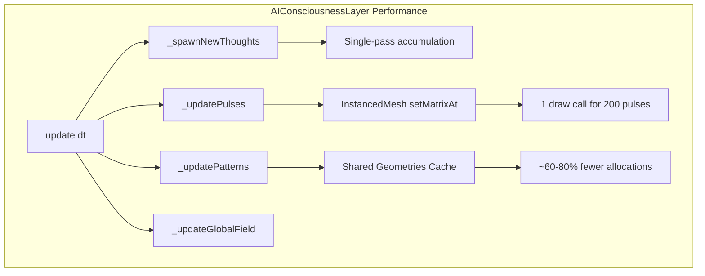

# AIConsciousnessLayer Performance Optimization Plan

## Prioritized Optimizations (User Selected)

### 1. InstancedMesh for Pulse Particles ✅ HIGH IMPACT
**Current State:** Each pulse creates its own `THREE.Mesh(SphereGeometry, MeshBasicMaterial)` → 200 draw calls for 200 pulses

**Goal:** Single `InstancedMesh` with shared geometry and material
```javascript
// Replace pool individual meshes:
this.pulseInstanceMesh = new THREE.InstancedMesh(
  new THREE.SphereGeometry(0.12, 8, 6),
  new THREE.MeshBasicMaterial({...}),
  200  // max instances
);
```

**Benefits:**
- ~95% draw calls reduction (200 individual → 1 InstancedMesh)
- Single material shared across all instances
- Instance transforms updated via matrix
- Compatible with existing particle pool structure

**Implementation Points:**
- `_initializeParticlePools()`: Create InstancedMesh instead of individual meshes
- `_spawnPulsePacket()`: Set instance matrix instead of mesh.position
- `_updatePulses()`: Update instance matrices via `setMatrixAt()`
- `dispose()`: Proper InstancedMesh disposal

---

### 2. Shared Geometries Cache for Semantic Patterns ✅ MEDIUM IMPACT
**Current State:** Each pattern cluster creates new geometries (`RingGeometry`, `ConeGeometry`, etc.) every time

**Goal:** Cache shared geometries at construction time
```javascript
this._sharedGeometries = {
  ring: new THREE.RingGeometry(...),
  cone: new THREE.ConeGeometry(...),
  disc: new THREE.CircleGeometry(...),
  torus: new THREE.TorusGeometry(...),
  box: new THREE.BoxGeometry(...),
  icosahedron: new THREE.IcosahedronGeometry(...)
};
```

**Benefits:**
- ~60-80% fewer geometry allocations
- Reuse across all pattern clusters
- Single disposal at layer shutdown
- Memory efficient

**Implementation Points:**
- `_initializeSharedGeometries()`: Create cached geometries
- `_createSemanticPattern()`: Use shared geometries with `clone()` or direct reference
- `dispose()`: Dispose only cached geometries once

---

## Excluded (Lower Priority)

| Optimization | Reason |
|--------------|--------|
| LOD for threads | User selected top 2 only |
| Single-pass accumulation | User selected top 2 only |
| Shader-based global field | User selected top 2 only |

---

## Mermaid Architecture



---

## Implementation Checklist

- [ ] Create `_initializeInstancedMesh()` method
- [ ] Replace `_spawnPulsePacket()` mesh creation with instance matrix update
- [ ] Update `_updatePulses()` to use `instanceMatrix.needsUpdate`
- [ ] Create `_initializeSharedGeometries()` method
- [ ] Update `_createSemanticPattern()` to use cached geometries
- [ ] Update `dispose()` for both optimizations
- [ ] Preserve existing API compatibility
- [ ] Add debug info for instance count

---

## Backward Compatibility

- All existing public API methods preserved (`enable()`, `disable()`, `debug()`, etc.)
- Particle pool structure unchanged internally
- Visual behavior identical to original
- Disposal properly cleaned up
