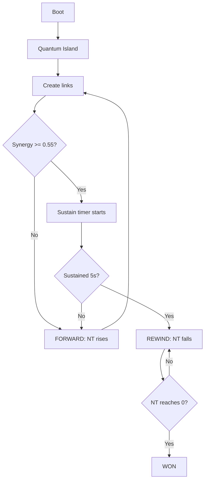

# Alpha Hardening Wave — Plán
## Cieľ: Dostať ATOMA do alpha-playable stavu (čitateľné, výkonovo stabilné)

---

## 1. Gameplay Loop Lock-In (Priorita #1)

### Problém
- Rewind synergy threshold = 0.82 (canonical `global.synergy.high`)
- NodeMetricEngine synergy steady-state po rebalance je 0.26–0.51
- Hráč sa technicky nemôže dostať do REWIND, nieto WON

### Riešenie
- **Znížiť threshold** z 0.82 → 0.55 (alebo 0.60 pre istotu)
  - Súbor: `VisualNetworkTimeElasticity_v1.js` riadok 33
  - Súbor: `MainMenu.js` world scoreConfig (riadky 46, 61, 77, 93, 109, 125)
- **Overiť forward/rewind rýchlosti**
  - Forward: 5/sec, Rewind: 3.5/sec — ak hráč udrží synergy 0.55+ 5 sekúnd, NT klesá
  - Escalation divisor 300 znamená že forward sa zrýchľuje s NT — overiť či to nie je príliš agresívne
- **Overiť REWIND gate**
  - Min nodes: 4, min links: 3, avg quality: 0.55 — toto by malo byť dosiahnuteľné

### Acceptance
- [ ] Hráč sa vie dostať z bootu do REWIND bez debug pomoci
- [ ] WON je stabilne dosiahnuteľné pri dobrej hre (nie len občasný smoke success)

---

## 2. Performance Hot Spots (Priorita #2)

### Tier 1 — Nulové riziko, garantovaný zisk

| # | Optimalizácia | Súbor(y) | Očakávaný gain |
|---|---------------|----------|----------------|
| 1 | Memoizovať `activeLinkCount` | `main.js` — nájsť všetky 14+ `filter()` volaní | ~0.3–0.5ms/frame |
| 2 | De-duplikovať `synapticGatingAdapter.updateNodeGates()` | `main.js` — 3× volanie za tick | ~0.1–0.2ms/frame |
| 3 | Spojiť `visualSuperpack + cinematicUpgrade` | `main.js` — dva separátne callbacky | ~0.05ms/frame |
| 4 | Pre-compute active node snapshot | `main.js` — 10+ systémov iteruje `aiNodes.nodes` | ~0.2–0.3ms/frame |

### Tier 2 — Veľmi nízke riziko

| # | Optimalizácia | Súbor(y) | Očakávaný gain |
|---|---------------|----------|----------------|
| 5 | CascadeParticleSystem: 3000 → 1500 max | `main.js` konfigurácia | Nižšia memory pressure |
| 6 | HealingParticleSystem: 5000 → 2500 max | `main.js` konfigurácia | Nižšia memory pressure |
| 7 | HarmonicResonanceFeedbackSystem: 8000 → 4000 | Konštruktor default | Nižšia memory pressure |

### Acceptance
- [ ] Žiadne obvious frame spikes v bežnej hre na Quantum Island / Dream Desert
- [ ] FPS zostáva stabilný (min 30fps na bežnom hardvéri)

---

## 3. HUD & Player Feedback (Priorita #3)

### Problém
- Hráč nerozumie, prečo je hra vo FORWARD
- Hráč nevidí, čo blokuje rewind
- Sustain progress bar existuje ale lock reason text je príliš technický

### Riešenie
- **Vylepšiť `CoreMetricsHUD.js`**:
  - Lock reason text: "NEED MORE NODES" → "Link more nodes (need 4+)"
  - Lock reason text: "QUALITY TOO LOW" → "Improve link quality"
  - Lock reason text: "SYNERGY TOO LOW" → "Build better network synergy"
  - Pridať vizuálny hint: šípka ukazujúca smer NT (hore = FORWARD, dole = REWIND)
  - Drama zone: zlatý border keď NT < 20 — jasná indikácia "skoro tam"

### Acceptance
- [ ] Hráč vie po 30 sekundách hrania povedať: "musím zvýšiť synergy aby sa začal rewind"
- [ ] Hráč vie prečo sa nedeje rewind (HUD ukáže dôvod)

---

## 4. Testovací plán

### Gameplay Loop Test
1. Boot → Quantum Island
2. Vytvoriť 4+ linky medzi rôznymi kategóriami
3. Sledovať synergy bar v HUD
4. Potvrdiť že synergy dosiahne 0.55+ a sustain bar sa začne plniť
5. Potvrdiť že po 5s sa spustí REWIND (NT klesá)
6. Potvrdiť že pri udržaní synergy sa NT dostane na 0 → WON

### Performance Smoke Test
1. Spustiť hru na Quantum Island
2. Vytvoriť 10+ linkov
3. Sledovať FPS cez browser devtools
4. Potvrdiť žiadne trvalé FPS kolapsy
5. Potvrdiť žiadne obvious frame spikes

---

## Architektonické obmedzenia (nemeníme)

- `FrameScheduler` — zachovať 10Hz sim, 30Hz vizuál, 60Hz runtime
- `MetricsRuntime_v1` — canonical metric authority
- `VisualHierarchyRegistry` — render order authority
- Canonical metrics: `synergy`, `harmony`, `stability`, `corruption`, `loadPressure`

---

## Mermaid diagram: Gameplay loop flow

---

## Rozsah: MEDIUM
- Jedno-subsystem tuning (gameplay loop) + performance hot spots
- Žiadne architektonické zmeny
- Zachovať všetky canonical authorities
