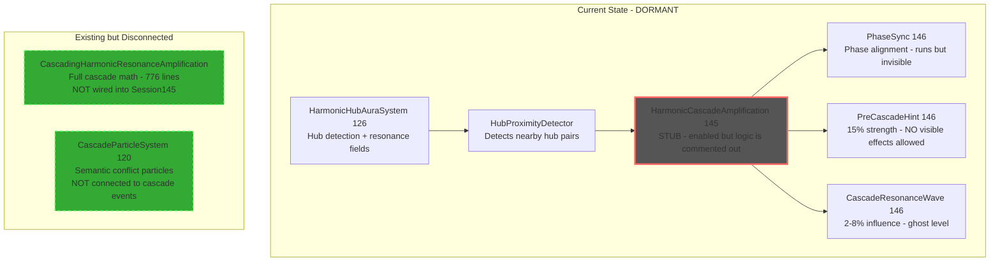
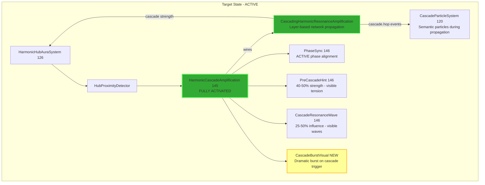
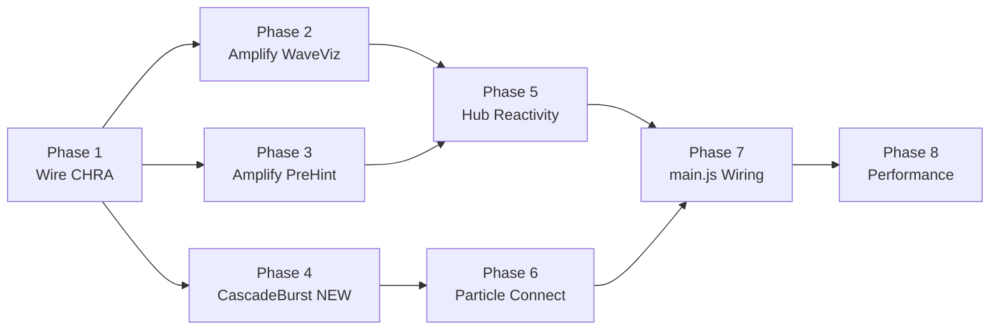

# Cascade Amplification Activation Plan

**Date**: 2026-04-10  
**Scope**: MEDIUM-HIGH — Activate dormant cascade amplification and make it visually dramatic  
**Subsystem**: Harmonic/Cascade  
**Innovation Budget**: MEDIUM-HIGH (explicit user request to upgrade visuals)

---

## Problem Statement

The Harmonic Cascade Amplification system (Session 145+) has been built as a "safe skeleton" with:
- Proximity detection active but cascade propagation logic is a **stub**
- `CascadeResonanceWaveVisualization` running at **ghost-level** (2-8% influence, barely perceptible)
- `PreCascadeVisualHint` at **15% strength** with constraints forbidding any visible effect
- `CascadingHarmonicResonanceAmplification` (776 lines of full cascade math) exists but is **not wired** into Session145

The infrastructure is solid. The cascade never triggers.

---

## Architecture Overview





---

## Implementation Phases

### Phase 1: Wire CascadingHarmonicResonanceAmplification into Session145

**File**: `HarmonicCascadeAmplification_Session145.js`

**What**: Replace the stub in `update()` with actual cascade propagation by wiring the existing `CascadingHarmonicResonanceAmplification` class.

**Changes**:
1. Import `CascadingHarmonicResonanceAmplification` in Session145
2. Instantiate it in constructor, passing network topology from `harmonicHubSystem`
3. In `update()`, after proximity detection, call `cascadingAmplification.update(deltaTime)` when proximity pairs exist
4. Implement `getHubAmplification()` to read from `cascadingAmplification.nodeLayerData`
5. Implement `getCascadeForHub()` to return cascade data from the amplification system
6. Emit `cascade.start` / `cascade.hop` / `cascade.end` semantic events when cascades trigger/propagate/end

**Why**: The cascade math already exists in `CascadingHarmonicResonanceAmplification` (BFS layer propagation, secondary hub detection, multi-cascade interference). It just needs to be connected.

**Risk**: LOW — wiring existing code, no new algorithms

---

### Phase 2: Amplify CascadeResonanceWaveVisualization

**File**: `CascadeResonanceWaveVisualization_Session146.js`

**What**: Increase visual parameters from ghost-level to clearly visible.

**Changes**:
1. Increase `waveInfluenceMin` from `0.02` → `0.25`
2. Increase `waveInfluenceMax` from `0.08` → `0.50`
3. Increase `wavefrontRingOpacity` from `0.12` → `0.35`
4. Increase `linkBeamOpacity` from `0.08` → `0.25`
5. Increase `hubGlowIntensity` from `0.05` → `0.20`
6. Increase `echoTrailOpacity` from `0.03` → `0.12`
7. Lower `minPhaseSyncStrength` from `0.04` → `0.02` (trigger more easily)
8. Lower `minCascadeStrengthTrigger` from `0.15` → `0.08`

**Also in `main.js`**: Update the rebinding config at lines 15678-15680 to match new values.

**Why**: The wave visualization already has ring pools, beam pools, and shader materials. It's just running at near-zero intensity.

**Risk**: LOW — parameter tuning only

---

### Phase 3: Amplify PreCascadeVisualHint

**File**: `PreCascadeVisualHint_Session146.js`

**What**: Increase hint strength from 15% to visible tension cues.

**Changes**:
1. Increase `hintStrengthMult` from `0.15` → `0.45`
2. Increase `auraCoherenceBias` from `0.1` → `0.3`
3. Increase `auraSilhouetteCompress` from `0.05` → `0.15`
4. Increase `linkPhaseCompression` from `0.08` → `0.20`
5. Increase `fieldBreathingAmplitude` from `0.12` → `0.30`

**Why**: Pre-cascade hints should create visible anticipation. Players should feel tension building before cascade triggers.

**Risk**: LOW — parameter tuning only

---

### Phase 4: Create CascadeBurstVisual Effect

**File**: NEW `CascadeBurstVisual_Session147.js`

**What**: Create a dramatic burst visual when a cascade triggers from a hub.

**Design**:
- **Trigger**: When `CascadingHarmonicResonanceAmplification` detects a hub crossing the cascade threshold
- **Visual**: Expanding energy shell from the hub + radial light rays + shockwave ring
- **Duration**: 0.8-1.2 seconds, auto-fade
- **Pool**: Pre-allocated mesh pool (max 8 simultaneous bursts)
- **Color**: Derived from hub harmony/synergy state (warm gold for high harmony, cool cyan for high synergy)
- **LOD**: Near = full shell + rays + ring, Far = glow only
- **Integration**: Subscribes to `cascade.start` semantic event

**Architecture**:
```
CascadeBurstVisual {
  - burstPool: Array of pre-allocated burst rigs
  - Each rig: shell mesh + ray group + ring mesh
  - update(dt): animate active bursts, recycle completed
  - triggerBurst(hubPosition, strength, color): activate from pool
  - LOD: distance-based quality reduction
}
```

**Why**: Cascade triggering is the dramatic moment. It needs a clear visual payoff.

**Risk**: MEDIUM — new system, but isolated and pooled

---

### Phase 5: Connect Cascade State to HarmonicHubAuraSystem

**File**: `HarmonicHubAuraSystem_Session126.js`

**What**: Hub resonance fields should react when cascade is active.

**Changes**:
1. Add `cascadeStrength` parameter to hub field update
2. When cascade active on a hub:
   - Increase field pulse rate by `cascadeStrength * 0.4`
   - Expand field radius by `cascadeStrength * 0.3`
   - Boost field opacity by `cascadeStrength * 0.2`
   - Shift field color toward cascade energy color
3. Read cascade state from `HarmonicCascadeAmplification.getCascadeForHub()`

**Why**: Hub fields are the primary visual anchor. They must show cascade activity.

**Risk**: LOW-MEDIUM — modifying existing system, but additive only

---

### Phase 6: Connect Cascade Events to CascadeParticleSystem

**File**: `CascadeParticleSystem_Session120.js` + `main.js`

**What**: Spawn semantic cascade particles when cascade propagates through the network.

**Changes**:
1. Ensure `CascadeEventBridge_v1` receives `cascade.hop` events from the activated cascade
2. Verify `cascadeIntensity` is set on links during cascade propagation
3. The existing particle system should automatically spawn particles — verify the pathway works end-to-end
4. If needed, add a direct `triggerCascadeParticles(nodePosition, strength, conflictType)` method

**Why**: Cascade particles already have semantic encoding (arcs, forks, shards, blobs). They should fire during cascade propagation.

**Risk**: LOW — verifying existing pathway, may need minor wiring fix

---

### Phase 7: Update main.js Wiring

**File**: `main.js`

**What**: Connect all new pathways and ensure proper initialization order.

**Changes**:
1. Update `setupHarmonicCascadeAmplification()` to pass network reference to `CascadingHarmonicResonanceAmplification`
2. Update rebinding config for `CascadeResonanceWaveVisualization` with amplified values
3. Wire `CascadeBurstVisual` into the initialization chain
4. Register `CascadeBurstVisual` update in FrameScheduler (visual lane)
5. Ensure `harmonicCascadeAmplification` is accessible from `harmonicHubAuraSystem` for cascade state reads
6. Update console API to include cascade burst controls

**Why**: All new connections need proper initialization and scheduler registration.

**Risk**: LOW-MEDIUM — wiring changes, must respect init order

---

### Phase 8: Performance Validation

**What**: Ensure the activated cascade system stays within frame budget.

**Checks**:
1. Cascade propagation (`CascadingHarmonicResonanceAmplification`): should be <2ms for 50-node network
2. Wave visualization: should be <1ms with amplified parameters
3. Cascade burst: should be <0.5ms per active burst
4. Hub field cascade reaction: should be <0.3ms additional
5. Total cascade overhead target: <4ms per frame
6. Verify LOD works at distance for all new effects
7. Update console API with cascade debug commands
8. Test with `window.CASCADE_CONFIG` and `window.CASCADE_STATS`

**Why**: Browser performance constraint. Must validate before shipping.

**Risk**: LOW — measurement and tuning

---

## File Change Summary

| File | Action | Scope |
|------|--------|-------|
| `HarmonicCascadeAmplification_Session145.js` | Modify — wire CHRA, implement cascade logic | MEDIUM |
| `CascadeResonanceWaveVisualization_Session146.js` | Modify — amplify parameters | LOW |
| `PreCascadeVisualHint_Session146.js` | Modify — amplify parameters | LOW |
| `CascadeBurstVisual_Session147.js` | NEW — dramatic burst effect | MEDIUM |
| `HarmonicHubAuraSystem_Session126.js` | Modify — cascade reactivity | LOW-MEDIUM |
| `main.js` | Modify — wiring and initialization | MEDIUM |
| `CascadeParticleSystem_Session120.js` | Minor — verify pathway | LOW |

---

## Execution Order



Phases 2, 3, and 4 can run in parallel after Phase 1 completes.
Phase 5 and 6 can run in parallel after their dependencies.
Phase 7 consolidates all wiring.
Phase 8 validates everything.
