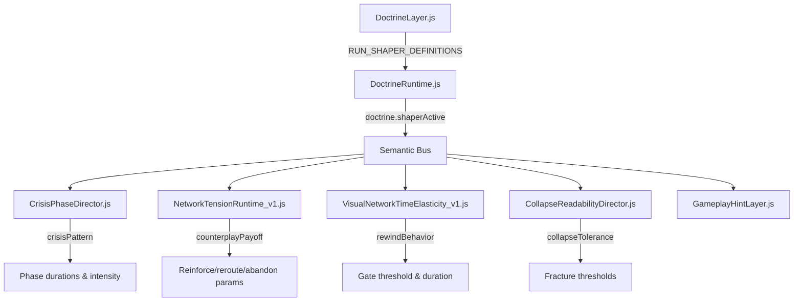

# Doctrine As Run-Shaper, Not Overlay

## Goal
Replace 5 weak numeric schools with 3 strong doctrines that shape the **type of decisions** players make during a run. Each doctrine changes crisis pattern, collapse tolerance, and counterplay payoff ratios.

## Current State
- 5 Schools of Thought: `synergy_cascade`, `stability_doctrine`, `pressure_embrace`, `harmony_resonance`, `corruption_acceptance`
- All are numeric metric modifiers (scale, drift, softCap)
- CrisisPhaseDirector already manages phased crisis lifecycle with world-specific grammar
- NetworkTensionRuntime already has crisis profile overrides

## Design: 3 Strong Run-Shapers

### 1. SACRIFICE & PIVOT (`sacrifice_pivot`)
**Decision type**: Abandon weak corridors, reroute quickly, let things break.

- **Crisis pattern**: Shorter, more intense. Peak compressed (0.6x duration). Decay faster (0.5x).
- **Collapse tolerance**: Higher. Nodes tolerate +0.15 corruption before fracturing. Collapse is less punishing.
- **Counterplay payoff**: Reroute relief 1.6x. Reinforce duration 0.6x, cost 1.4x. Abandon gives +0.3 stability to adjacent nodes.
- **Rewind behavior**: Gate threshold -0.05 (easier to open), but gate duration 0.7x (closes faster).
- **Visual**: Links break with minimal drama. Reroute creates bright cyan flash.

### 2. REINFORCE DISCIPLINE (`reinforce_discipline`)
**Decision type**: Hold lines, reinforce corridors, weather the storm.

- **Crisis pattern**: Longer, less spiky. Surge builds slowly (1.4x duration). Peak extended (1.5x).
- **Collapse tolerance**: Lower. Nodes fracture at -0.1 threshold. But reinforced links are much stronger.
- **Counterplay payoff**: Reinforce duration 1.8x, stability cost 0.5x. Reroute relief 0.8x. Abandon gives no bonus.
- **Rewind behavior**: Gate threshold +0.06 (harder to open), but gate duration 1.5x (stays open longer).
- **Visual**: Reinforced links glow amber. Collapse warnings are larger and more prominent.

### 3. RISKY REWIND (`risky_rewind`)
**Decision type**: Aggressive stabilization, gambling on precise rewind timing.

- **Crisis pattern**: Very short PEAK (0.5x) but max intensity (1.3x). Success requires timing.
- **Collapse tolerance**: Medium. Collapse is faster (+0.08 rate), but recovery is also faster (1.3x).
- **Counterplay payoff**: Neither reroute nor reinforce is favored. Successful rewind during PEAK gives massive synergy bonus (+0.15).
- **Rewind behavior**: Gate threshold -0.08 during crisis (very easy), but failure to rewind during PEAK causes +0.05 corruption.
- **Visual**: Rewind gate pulses magenta aggressively. Timing windows have chromatic aberration.

## Architecture



## File Changes

### 1. `src/doctrine/DoctrineLayer.js` (MODIFY)
- Replace `SCHOOL_OF_THOUGHT_DEFINITIONS` with `RUN_SHAPER_DEFINITIONS`
- 3 shapers with full config objects
- Keep `WORLD_MUTATOR_DEFINITIONS` and `CRISIS_CARD_DEFINITIONS` unchanged
- Update `getSchoolOfThought` → `getRunShaper`
- Update `getAvailableSchools` → `getAvailableShapers`
- Update `sanitizeDoctrineState` to use `activeShaper` (single) instead of `activeSchools` (array)
- Update `applyDraftToState` for single shaper
- Update `computeDoctrineModifiers` to return shaper config instead of numeric modifiers
- Update `determineMilestoneDoctrineUnlocks` for new shaper IDs

### 2. `src/doctrine/DoctrineRuntime.js` (MODIFY)
- Replace `_activeSchool` with `_activeShaper`
- `selectSchool` → `selectShaper`
- Emit `doctrine.shaperActive` on semantic bus when shaper selected
- Keep crisis trigger logic unchanged
- Update overlay rendering to show shaper decision-type tags instead of metric mod tags

### 3. `CrisisPhaseDirector.js` (MODIFY)
- Subscribe to `doctrine.shaperActive`
- Store `_activeShaperConfig`
- In `_onCrisisStart`, apply shaper's `crisisPattern` to phase durations
- In `_computeIntensity`, apply shaper's `intensityCurve` multiplier
- In `_applyCrisisOverrides`, merge shaper counterplay config with world config

### 4. `NetworkTensionRuntime_v1.js` (MODIFY)
- Add `_shaperConfig` field
- Subscribe to `doctrine.shaperActive` via eventRegistrationRegistry
- In `_applyTickPressure`, apply shaper `tickPressureScale`
- In `tryReinforceCorridor`, apply shaper `reinforceDurationScale` and `reinforceCostScale`
- In `noteLinkCreated` (reroute), apply shaper `rerouteReliefScale`
- In abandon flow, apply shaper `abandonReliefScale`

### 5. `VisualNetworkTimeElasticity_v1.js` (MODIFY)
- Add `_shaperConfig` field
- Subscribe to `doctrine.shaperActive`
- In `_evaluateRewindGate`, apply shaper `thresholdOffset` and `gateDurationScale`
- In `onCrisisPhaseChanged`, apply shaper `peakBonusMultiplier` for PEAK phase

### 6. `src/collapse/CollapseReadabilityDirector.js` (MODIFY)
- Add `_shaperConfig` field
- Subscribe to `doctrine.shaperActive`
- In `_evaluateNodeThreat`, apply shaper `fractureThresholdOffset`
- In `_onCrisisPhaseChanged`, apply shaper `threatElevation` config

### 7. `HUD/GameplayHintLayer.js` (MODIFY)
- Add 3 doctrine-specific hint entries
- Each with world-specific variants

### 8. `src/doctrine/DoctrineIntegration.js` (MODIFY)
- Update `determineMilestoneDoctrineUnlocks` references for new shaper IDs
- Update `describeDoctrineUnlock` for shapers

### 9. `main.js` (MODIFY)
- Wire `doctrine.shaperActive` event through semantic bus
- Ensure CrisisPhaseDirector, NetworkTensionRuntime, VisualNetworkTimeScore, CollapseReadabilityDirector all receive the event

### 10. `tests/GameplayLoopChecks.js` (MODIFY)
- Add tests for each shaper's crisis pattern effect
- Add tests for counterplay payoff ratios
- Add tests for rewind behavior
- Add tests for collapse tolerance

## Backward Compatibility
- Old `activeSchools` array in saved state will be migrated: first element becomes `activeShaper`
- Old school IDs (`synergy_cascade`, `stability_doctrine`, etc.) map to new shapers:
  - `synergy_cascade` + `pressure_embrace` → `sacrifice_pivot`
  - `stability_doctrine` → `reinforce_discipline`
  - `harmony_resonance` + `corruption_acceptance` → `risky_rewind`
- `computeDoctrineModifiers` still returns an object for legacy consumers, but now includes `shaperConfig`

## Event Contract

```
doctrine.shaperActive
  payload: {
    shaperId: string,
    shaperConfig: object,
    world: string
  }
```

## Testing Strategy
1. Test each shaper's phase duration scaling
2. Test each shaper's counterplay payoff ratios
3. Test each shaper's rewind gate behavior
4. Test each shaper's collapse tolerance effect
5. Test backward compatibility migration
6. Test that only one shaper can be active at a time
