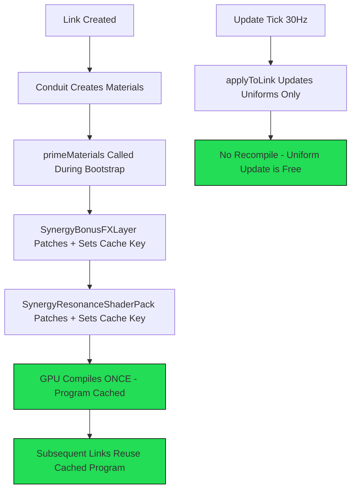

# SynergyResonanceShaderPack_v1 Optimization Plan

**Task Scope**: MEDIUM  
**Subsystem**: LINK SYSTEM → SynergyResonanceShaderPack  
**Goal**: Zero compile hitch after first link, shader variant consolidation, material reuse

---

## Problem Diagnosis

### Root Cause 1: Missing `customProgramCacheKey`

[`SynergyResonanceShaderPack_v1.js`](SynergyResonanceShaderPack_v1.js) patches materials via [`onBeforeCompile`](SynergyResonanceShaderPack_v1.js:112) but **never sets `customProgramCacheKey`**. This means Three.js compiles a **new GPU program for every single material instance**, even though all patched materials use identical shader code.

Compare with [`LinkSparkSystem.js`](LinkSparkSystem.js:210) or [`shaders/LinkAuraShader.js`](shaders/LinkAuraShader.js:91) which correctly set cache keys.

**Impact**: With 100 links × 4 materials each = 400 unique GPU programs instead of 1.

### Root Cause 2: Late Patching at Update Time

[`getMaterialState()`](SynergyResonanceShaderPack_v1.js:399) creates and patches materials lazily during the visual tick update. The first time a link material is encountered, it triggers:
1. `new ResonanceMaterialState(material)` 
2. `state.patch()` → sets `onBeforeCompile` 
3. `material.needsUpdate = true` → **forces GPU compile on next render**

This happens mid-frame during gameplay, causing the compile hitch.

### Root Cause 3: No Pre-Warm/Prime

[`SynergyBonusFXLayer_v1`](SynergyBonusFXLayer_v1.js) has a [`primeMaterials()`](main.js:12229) mechanism called from main.js, but `SynergyResonanceShaderPack_v1` has **no equivalent**. There's no way to pre-compile the shader before the first link appears.

### Root Cause 4: Duplicate `getConduitLinkMaterials()`

Both [`SynergyResonanceShaderPack_v1.js:8`](SynergyResonanceShaderPack_v1.js:8) and [`SynergyBonusFXLayer_v1.js:8`](SynergyBonusFXLayer_v1.js:8) define **identical** `getConduitLinkMaterials()` functions. This is code duplication.

### Root Cause 5: Both Systems Patch the Same Materials

`SynergyBonusFXLayer_v1` and `SynergyResonanceShaderPack_v1` both chain `onBeforeCompile` on the same materials. Each chain closure creates a unique function reference, and without `customProgramCacheKey`, Three.js sees each as requiring a different program.

---

## Shader Variant Explosion Chain

When a link material goes through the full pipeline:

```
LinkRendererConduit creates material
  → SynergyBonusFXLayer_v1 patches onBeforeCompile + needsUpdate = true → COMPILE 1
  → SynergyResonanceShaderPack_v1 patches onBeforeCompile + needsUpdate = true → COMPILE 2
  → LinkRendererConduit wave direction hook patches onBeforeCompile → COMPILE 3
  → PersonalityShaderBridge may patch onBeforeCompile → COMPILE 4
  → WaveShaderBridge may patch onBeforeCompile → COMPILE 5
```

Each `needsUpdate = true` after patching forces a recompile. With no cache key, none of these programs are shared.

---

## Solution Architecture

### Fix 1: Add `customProgramCacheKey` to Consolidate Variants

In [`ResonanceMaterialState.patch()`](SynergyResonanceShaderPack_v1.js:105), after setting `onBeforeCompile`, set a stable cache key:

```javascript
// After onBeforeCompile assignment
const previousKey = typeof this.material.customProgramCacheKey === 'function'
    ? this.material.customProgramCacheKey.bind(this.material)
    : null;

this.material.customProgramCacheKey = () => {
    const previous = previousKey ? String(previousKey() ?? '') : '';
    return `${previous}|SYNERGY_RESONANCE_v1`;
};
```

This ensures all resonance-patched materials share a single GPU program. The key chains with any previous cache key from other systems.

### Fix 2: Pre-Warm via `primeMaterials()` Method

Add a new method to [`SynergyResonanceShaderPack_v1`](SynergyResonanceShaderPack_v1.js:370):

```javascript
primeMaterials(links) {
    let count = 0;
    for (const link of links) {
        const materials = getConduitLinkMaterials(link);
        for (const material of materials) {
            if (!material[RESONANCE_FX_PATCHED]) {
                this.getMaterialState(material);
                count++;
            }
        }
    }
    return count;
}
```

Wire this into [`main.js`](main.js:12228) alongside the existing `synergyBonusFXLayer.primeMaterials()` call:

```javascript
if (this.synergyResonanceShaderPack?.primeMaterials) {
    primedCount += this.synergyResonanceShaderPack.primeMaterials(linkList) || 0;
}
```

### Fix 3: Event-Gated Mode Activation

Currently, all three shader modes are always active in the fragment shader. The shader code already has tier guards (`if (tier < 1) return result;`), but the GPU still evaluates branches.

The optimization is to make the **uniform update** event-gated — only push chromatic/flow uniforms when the relevant synergy tier is reached. This is already partially done in [`applyToLink()`](SynergyResonanceShaderPack_v1.js:432):

```javascript
const chromaStr = tier > 1 ? chromaShift * this.config.globalChromaticStrength : 0;
const flowSpeed = tier > 1 ? (tier / 3.0) * this.config.globalFlowSpeed : 0;
```

This is correct — modes B and C are already gated by tier > 1. No change needed here, but we should document this as the event-gating strategy.

### Fix 4: Remove `needsUpdate = true` After Initial Patch

The [`patch()`](SynergyResonanceShaderPack_v1.js:347) method sets `material.needsUpdate = true`, which forces a recompile. Since we're adding `customProgramCacheKey`, the first compile will be cached. But we should only set `needsUpdate` on the **first** patch, not on subsequent calls.

The current code already has a guard: `if (this.material[RESONANCE_FX_PATCHED]) return;` — so `needsUpdate` is only set once per material. This is correct.

### Fix 5: Coordinate with SynergyBonusFXLayer_v1

Both systems patch the same materials. The ideal solution is to ensure they set compatible `customProgramCacheKey` values that chain properly. Since both systems inject different shader code, they each need their own cache key segment:

- `SynergyBonusFXLayer_v1` should set: `...|SYNERGY_BONUS_v1`
- `SynergyResonanceShaderPack_v1` should set: `...|SYNERGY_RESONANCE_v1`

The key chaining pattern (from [`LinkRendererConduit.js:2249`](LinkRendererConduit.js:2249)) ensures these compose correctly.

---

## Implementation Steps

### Step 1: Add `customProgramCacheKey` to `ResonanceMaterialState.patch()`
- File: [`SynergyResonanceShaderPack_v1.js`](SynergyResonanceShaderPack_v1.js:105)
- Chain with any existing cache key
- Use stable suffix `SYNERGY_RESONANCE_v1`
- Mark material with `__resonanceProgramCacheKeyBound` guard

### Step 2: Add `primeMaterials()` method to `SynergyResonanceShaderPack_v1`
- File: [`SynergyResonanceShaderPack_v1.js`](SynergyResonanceShaderPack_v1.js:370)
- Iterate links, extract materials, call `getMaterialState()` for each
- Return count of newly primed materials

### Step 3: Wire `primeMaterials()` into main.js
- File: [`main.js`](main.js:12228)
- Add call after existing `synergyBonusFXLayer.primeMaterials()` 
- This ensures shaders compile during bootstrap, not during first link

### Step 4: Also add `customProgramCacheKey` to `SynergyBonusFXLayer_v1`
- File: [`SynergyBonusFXLayer_v1.js`](SynergyBonusFXLayer_v1.js:124)
- Same pattern as Step 1
- This fixes the companion system's variant explosion too

### Step 5: Verify no compile hitch
- Open browser, create first link
- Check that no frame spike > 16ms occurs after the initial prime

---

## Risk Assessment

- **Scope**: MEDIUM — changes are localized to two shader pack files + one main.js wiring
- **Affected subsystems**: LINK SYSTEM only (SynergyResonanceShaderPack + SynergyBonusFXLayer)
- **Breaking risk**: LOW — `customProgramCacheKey` is additive, `primeMaterials()` is a new method
- **Performance impact**: POSITIVE — reduces GPU program count from O(links × materials) to O(1)

---

## Expected Outcome

| Metric | Before | After |
|--------|--------|-------|
| GPU programs per link material | 1 unique | 1 shared |
| Compile hitch on first link | Yes (multi-frame) | No (pre-warmed) |
| Compile hitch on subsequent links | Possible | None (cache hit) |
| Memory per material | Full program | Shared program ref |

---

## Diagram: Shader Program Flow After Fix


